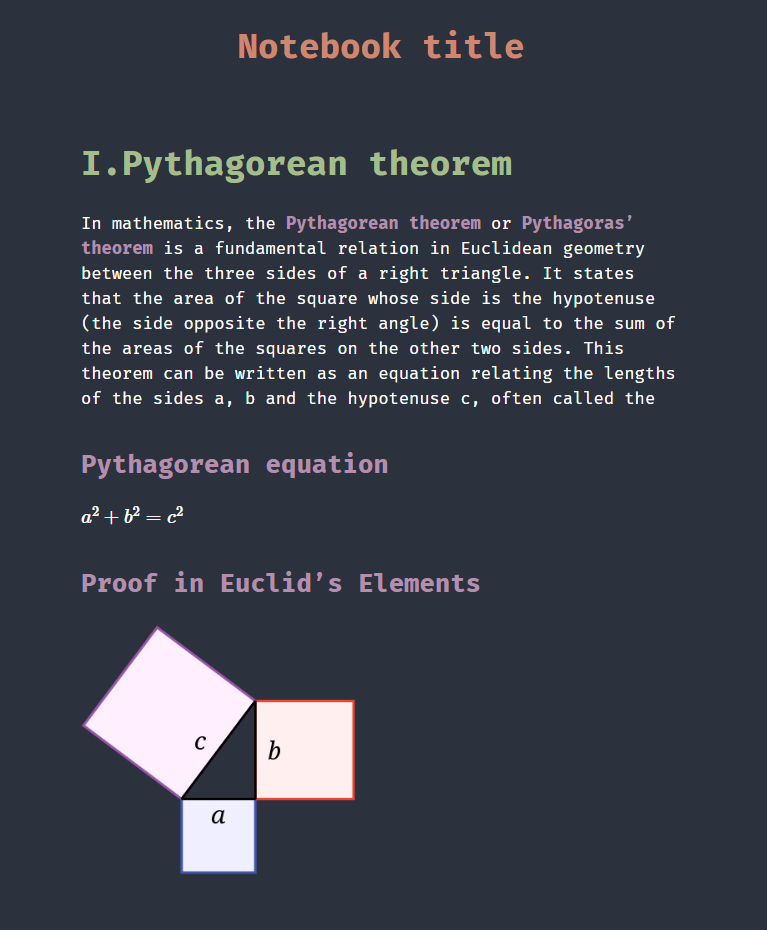

# 📝 CCNA

My notes from CCNAv7 sem3.

## 📦 Dependencies

- pandoc ([link to the pandoc's website](https://pandoc.org/))

## 👤 Credits
Project was made by Aleksander Jóźwik ([@jozwikaleksander](https://github.com/jozwikaleksander)).
# ccna
