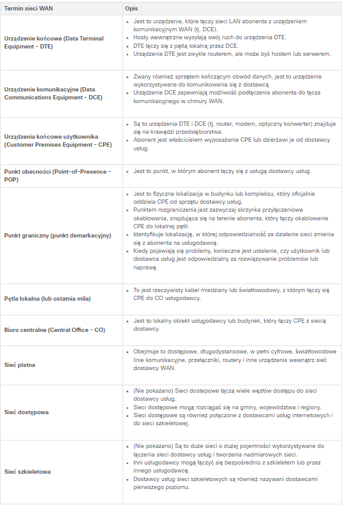
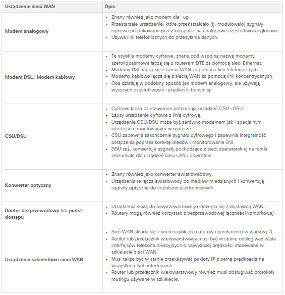

# I. Protokół OSPF

## 1. OSPF

**OSPF** to protokół routingu stanu łącza opracowany jako alternatywa dla RIP.
Wykorzystuje on koncepcje obszarów.

**Komunikaty OSPF są wykorzystywane do tworzenia i utrzymywanie trzech następujących baz danych OSPF:**

- **Baza przyległości (Adjacency database)** - Tworzy tablicę sąsiadów. - *show ip ospf neighbor*
- **Baza stanu łącza (Link-state database - LSDB)** - To tworzy tablicę topologii. *show ip ospf database*
- **Baza przekazywania (Forwarding database)** - To tworzy tablicę routingu. *show ip route*

Router używający OSPF buduje tablicę topologii przy użyciu obliczeń opartych na **algorytmie Dijkstry pierwszej najkrótszej ścieżki (shortest-path first - SPF)**.

W tym celu algorytm SPF tworzy tzw. **drzewo SPF**, każdy router umieszczany jest w korzeniu drzewa, po czym obliczana jest najkrótsza ścieżka do każdego węzła. Następnie na podstawie utworzonego drzewa SPF obliczana jest najlepsza ścieżka. Ostatecznie OSPF wstawia najlepsze ścieżki do tablicy przekazywania, na podstawie której tworzona jest tablica routingu.

## 2. Proces routingu stanu łącza

1. Ustanowienie przyległości sąsiadów - wysyłanie pakietów Hello, aby ustalić czy na danym łączu znajdują się sąsiedzi.
2. Wymiana komunikatów o stanie łącza (LSA) - pakiety LSA zawierające informacje na temat stanu oraz kosztu każdego bezpośrednio podłączonego łącza wysyłane są zalewowo do wszystkich sąsiadów.
3. Tworzenie bazy stanów łącza - Na podstawie pakietów LSA Routery tworzą **tablicę topologii (LSDB)**.
4. Wykonanie algorytmu SPF - Routery wykonują algorytm SPF.
5. Wybór najlepszej trasy - najlepsze ścieżki oferowane są do tablicy routingu IP.

## 3. OSPF wieloobszarowy zalety:
- Mniejsze tablice routingu
- Zmniejszony narzut aktualizacji stanu łącza
- Zmniejszona częstotliwość obliczeń SPF

## 4. OSFPv3
To odpowiednik OSPFv2 służacy do **wymiany prefiksów IPv6**.

## 5. Rodzaje pakietów OSPF

**DR** - Designed Router; **BDR** - Backup Designed Router

## 6. Stany protokołu OSPF:

# II. Konfiguracja jednoobszarowego OSPFv2

## 1. Identyfikator routera
To wartość 32-bitowa, która służy do jednoznacznej identyfikacji routera. Identyfikator ten służy do wykonywania następujących czynności:

- **Uczestniczenie w synchronizacji baz danych OSPF** - Podcas stanu Exchange, router z najwyższym identyfikatorrem routera jako pierwszy wyśle pakiety opisu bazy danych (DBD).
- **Uczestniczenie w wyborze routera desygnowanego (DR)** - router z najwyższym id jest DR, drugi najwyższy BDR.

## 2. Maska blankietowa (wildcard mask)
To odwrotność maski podsieci. (255.255.255.0 = 0.0.0.255).

## 3. Interfejsy pasywne 
Domyślnie komunikaty OSPF wysyłane są przez wszystkie interfejsy dołączone do protokołu OSPF. Jednak w praktyce powinny one być wysyłane tylko na tych interfejsach, na których jest połączenie z innym routerami z uruchomionym OSPF. 

Wysyłanie niepotrzebnych komunikatów może wpływać na działanie sieci na trzy sposoby:

- **Nieefektywne wykorzystanie pasma**
- **Nieefektywne wykorzystanie zasobów**
- **Zwiększone ryzyko bezpieczeństwa**

## 4. DROTHER
Routery, które nie są ani DR ani BDR.

## 5. Potrzebne komendy:
- **router ospf process-id** - włączenie OSPFv2.
- **router-id** - ustawienie identyfikatora routera.
- **clear ip ospf process** - wyczyszczenie procesu OSPF (w tym reset relacji przylegania).
- **show ip protocols** - daje możliwość zobaczenia identyfikatora routera oraz pasywnych interfejsów.
- **network network-address wildcard-mask area area-id** - włączenie protokołu OSPF na interfejsach.
- **ip ospf process-id area area-id** - pozwala na konfiguracje OSPf bezpośrednio na interfejsie zamiast polecenia **network**.
- **passive-interface** - ogranicza wysyłanie komunikatów dotyczących routingu przez interfejs. Komenda *passive-interface default* sprawia, że wszystkie interfejsy stają się pasywne.
- **show ip ospf interface** - wyświetla DR i BDR na interfejsie, rolę routera, bieżący koszt.
- **ip ospf network point-to-point** - zmienia typ wyznaczonej sieci na punkt-punkt i wyłącza proces wyboru DR/BDR.
- **ip ospf priority value** - ustawia priorytet interfejsu (od 0 do 255).
- **auto-cost reference-bandwidth *Mbps*** - zmienia referencyjną szerokośc pasma (co pozwala na zmianę kosztu dla interfejsów szybszych niż Fast Ethernet).
- **ip ospf cost *value*** - zmienia wartość kosztu ogłaszaną przez lokalny router OSPF do innych routerów OSPF .
- **ip ospf hello-interval *seconds*** - zmienia interwał hello.
- **ip ospf dead-interval *seconds*** - zmienia interwał dead.
- **ip route 0.0.0.0 0.0.0.0 *[next-hop-address | exit-interface]*** - domyślna trasa statyczna
- **default-information originate** - nakazuje routerowi być źródłem informacji o trasie domyślnej i propagowanie statycznej trasy domyślnej w aktualizacjach OSPF.
- **show ip interface brief** - sprawdza, czy żądane interfejsy są aktywne z poprawnym adresowaniem IP.
- **show ip route** - sprawdza, czy tablica routingu zawiera wszystkie oczekiwane trasy.

## 6. Koszt jako metryka w OSPF
Protokoły routingu używają **metryki** w celu wyznaczenia najlepszej trasy dla pakietu przez sieć. **Metryka** jest miarą nakładu wymaganego do przesłania pakietu przez dany interfejs.

Protokół OSPF używa jako metryki **kosztu ścieżki**. Im niższy koszt, tym lepsza trasa do celu.

**Koszt = referencyjna szerokość pasma / szerokość pasma interfejsu**

Wartość kosztu OSPF musi być **liczbą całkowitą**.

## 7. Interwały pakietów Hello
Pakiety OSPFv2 Hello są wysyłane co 10 sekund.

**Interwał Dead** to okres, przez jaki router będzie czekał na odbiór pakietu Hello, zanim zadeklaruje, że sąsiad jest wyłączony. (W Cisco domyślnie jest to 4-krotność interwału Hello, czyli 10 sek).

## 8. Propagowanie domyślnej trasy statycznej w OPSFv2

**Router brzegowy (router bramy)** - to router podłączony do Internetu, który powinien propagować domyślną trasę do innych routerów w lokalnej sieci.

**Router brzegowy systemu autonomicznego (Autonomous System Boundary Router, ASBR)** - router, który znajduję się pomiędzy domeną routingu OSPF a siecią bez OSPF.

# III. Koncepcje bezpieczeństwa sieci

## 1. Wektory ataków sieciowych

**Wekor ataku** - to ścieżka, dzięi której podmiot zagrożenia może uzyskać dostęp do serwera, hosta lub sieci. Wektory mogą pochodzić ze zewnątrz lub wewnąrz.

## 2. Typy hakerów

## 3. Terminy dotyczące hackingu

## 4. Narzędzia do testowania penetracji

## 5. Typy ataków

# VII. Koncepcje sieci WAN

## 1. Topologie WAN

- **Punkt-punkt**
- **Hub-and-spoke** - umożliwia współużytkowanie pojedynczego interfejsu na routerze centralnym (hub) przez wszystkie routery obwodowe (spoke).

- **Dual-homed** - zapewnia redundancję. Router centralny jest podwojony w lokalizacji a te nadmiarowo podłączone do routerów obwodowych w chmurze WAN.

- **Pełnej siatki** - wykorzystuje wiele obwodów wirtualnych do łączenia wszystkich lokalizacji.

- **Częściowej siatki** - łączy wiele, ale nie wszystkie lokalizacje.

## 2. Łącza operatorów
SLA - umowa o poziomie usług podpisywana między organizacją a usługodawcą. Przedstawia ona oczekiwane usługi związane z niezawodnością i dostępnością połączenia.

## 3. Standardy sieci WAN

Nowoczesne standardy sieci WAN są definiowane i zarządzane przez wiele uznanych organów, w tym:

- **TIA/EIA** - Telecommunications Industry Association and Electronic Industries Alliance
- **ISO** - International Organization for Standardization
- **IEEE** - Institute of Electrical and Electronics Engineers

## 4. Sieci WAN w modelu OSI

## 5. Terminologia WAN

## 6. Urządzenia sieci WAN

## 7. Komunikacja szeregowa
W sieciach WAN stosowana jest komunikacja szeregowa.

## 8. Komunikacja z komutacją łączy
**Sieć z komutacją łączy** ustanawia dedykowany obwód (lub kanał) między punktami końćowymi, zanim użytkownicy będą mogli się komunikować.

Podczas transmisji w sieci z komutacją łączy cała komunikacja korzysta z tej samej ścieżki. Cała stała pojemność przydzielona do obwodu jest dostępna na czas połączenia, niezależnie od tego, czy są informacje do transmisji, czy nie. Może to prowadzić do nieefektywności w użyciu obwodu. Z tego powodu komutacja łączy zasadniczo nie nadaje się do przesyłania danych.

Dwa najpopularniejsze typy technologii WAN z komutacją łączy to **publiczna komutowana sieć telefoniczna (PSTN)** i **sieć cyfrowa z integracją usług (ISDN)**.

## 9. Komunikacja z przełączaniem pakietów

W przeciwieństwie do komutacji łączy, przełączanie pakietów dzieli dane ruchu na pakiety, które są kierowane w sieci współużytkowanej. Przełączanie pakietów, nie wymaga zestawienia specjalnego obwodu/połączenia, ponadto pozwalają kilku urządzeniom komunikować się za pomocą tego samego kanału.

Typowe rodzaje technologii WAN z przełączaniem pakietów to **Ethernet WAN (Metro Ethernet)**, **Multiprotocol Label Switching (MPLS)**, a także starszy **Frame Relay** i starszy **Asynchronous Transfer Mode (ATM)**.

## 10. SDH, SONET i DWDM
Istnieją dwa optyczne standardy warstwy 1 OSI dostępne dla dostawców usług:

- **Synchronous Digital Hierarchy (SDH)** to globalny standard transportu danych za pomocą kabla światłowodowego.
- **Synchronous Optical Networking (SONET)** to norma północnoamerykańska, która świadczy te same usługi co SDH.

**Dense Wavelength Division Multiplexing (DWDM)** to nowsza technologia, która zwiększa nośność danych SDH i SONET poprzez jednoczesne wysyłanie wielu strumieni danych (multipleksowanie) przy użyciu różnych długości fal światła, jak pokazano na rysunku.

## 11. MPLS

**Multiprotocol Label Switching (MPLS)** to wysokowydajna technologia routingu WAN dla dostawcy usług umożliwiająca łączenie klientów bez względu na metodę dostępu lub typ obciążenia. MPLS obsługuje różne metody dostępu klienta (np. Ethernet, DSL, Cable, Frame Relay). MPLS może enkapsulować ruch wszystkich typy protokołów, w tym IPv4 i IPv6.