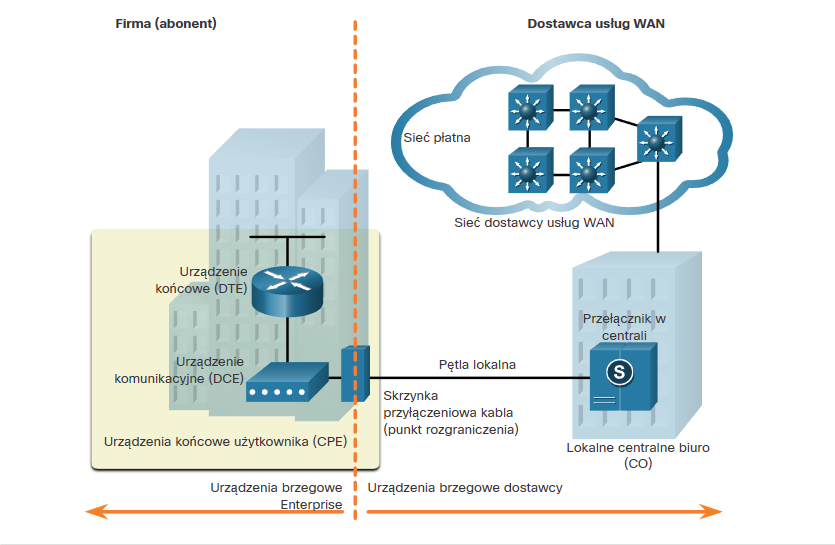
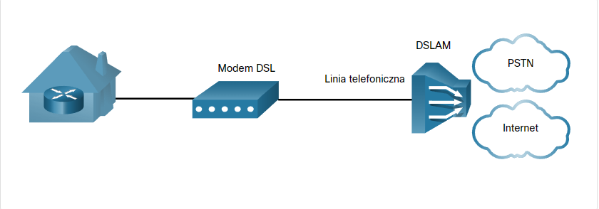

# I. Protokół OSPF

## 1. OSPF

**OSPF** to protokół routingu stanu łącza opracowany jako alternatywa dla RIP.
Wykorzystuje on koncepcje obszarów.

**Komunikaty OSPF są wykorzystywane do tworzenia i utrzymywanie trzech następujących baz danych OSPF:**

- **Baza przyległości (Adjacency database)** - Tworzy tablicę sąsiadów. - *show ip ospf neighbor*
- **Baza stanu łącza (Link-state database - LSDB)** - To tworzy tablicę topologii. *show ip ospf database*
- **Baza przekazywania (Forwarding database)** - To tworzy tablicę routingu. *show ip route*

Router używający OSPF buduje tablicę topologii przy użyciu obliczeń opartych na **algorytmie Dijkstry pierwszej najkrótszej ścieżki (shortest-path first - SPF)**.

W tym celu algorytm SPF tworzy tzw. **drzewo SPF**, każdy router umieszczany jest w korzeniu drzewa, po czym obliczana jest najkrótsza ścieżka do każdego węzła. Następnie na podstawie utworzonego drzewa SPF obliczana jest najlepsza ścieżka. Ostatecznie OSPF wstawia najlepsze ścieżki do tablicy przekazywania, na podstawie której tworzona jest tablica routingu.

## 2. Proces routingu stanu łącza

1. **Ustanowienie przyległości sąsiadów** - wysyłanie pakietów Hello, aby ustalić czy na danym łączu znajdują się sąsiedzi.
2. **Wymiana komunikatów o stanie łącza (LSA)** - pakiety LSA zawierające informacje na temat stanu oraz kosztu każdego bezpośrednio podłączonego łącza wysyłane są zalewowo do wszystkich sąsiadów.
3. **Tworzenie bazy stanów łącza** - Na podstawie pakietów LSA Routery tworzą **tablicę topologii (LSDB)**.
4. **Wykonanie algorytmu SPF** - Routery wykonują algorytm SPF.
5. **Wybór najlepszej trasy** - najlepsze ścieżki oferowane są do tablicy routingu IP.

## 3. Zalety wieloobszarowego OSPF
- Mniejsze tablice routingu
- Zmniejszony narzut aktualizacji stanu łącza
- Zmniejszona częstotliwość obliczeń SPF

## 4. OSFPv3
To odpowiednik OSPFv2 służacy do **wymiany prefiksów IPv6**.

## 5. Rodzaje pakietów OSPF

**DR** - Designed Router; **BDR** - Backup Designed Router

## 6. Stany protokołu OSPF

# II. Konfiguracja jednoobszarowego OSPFv2

## 1. Identyfikator routera
To wartość 32-bitowa, która służy do jednoznacznej identyfikacji routera. Identyfikator ten służy do wykonywania następujących czynności:

- **Uczestniczenie w synchronizacji baz danych OSPF** - Podczas stanu Exchange, router z najwyższym identyfikatorrem routera jako pierwszy wyśle pakiety opisu bazy danych (DBD).
- **Uczestniczenie w wyborze routera desygnowanego (DR)** - router z najwyższym id jest DR, drugi najwyższy BDR.

## 2. Maska blankietowa (wildcard mask)
To odwrotność maski podsieci. (255.255.255.0 = 0.0.0.255).

## 3. Interfejsy pasywne 
Domyślnie komunikaty OSPF wysyłane są przez wszystkie interfejsy dołączone do protokołu OSPF. Jednak w praktyce powinny one być wysyłane tylko na tych interfejsach, na których jest połączenie z innym routerami z uruchomionym OSPF. 

Wysyłanie niepotrzebnych komunikatów może wpływać na działanie sieci na trzy sposoby:

- **Nieefektywne wykorzystanie pasma**
- **Nieefektywne wykorzystanie zasobów**
- **Zwiększone ryzyko bezpieczeństwa**

## 4. DROTHER
Routery, które nie są ani DR ani BDR.

## 5. Potrzebne komendy
- **router ospf process-id** - włączenie OSPFv2.
- **router-id** - ustawienie identyfikatora routera.
- **clear ip ospf process** - wyczyszczenie procesu OSPF (w tym reset relacji przylegania).
- **show ip protocols** - daje możliwość zobaczenia identyfikatora routera oraz pasywnych interfejsów.
- **network network-address wildcard-mask area area-id** - włączenie protokołu OSPF na interfejsach.
- **ip ospf process-id area area-id** - pozwala na konfiguracje OSPf bezpośrednio na interfejsie zamiast polecenia **network**.
- **passive-interface** - ogranicza wysyłanie komunikatów dotyczących routingu przez interfejs. Komenda *passive-interface default* sprawia, że wszystkie interfejsy stają się pasywne.
- **show ip ospf interface** - wyświetla DR i BDR na interfejsie, rolę routera, bieżący koszt.
- **ip ospf network point-to-point** - zmienia typ wyznaczonej sieci na punkt-punkt i wyłącza proces wyboru DR/BDR.
- **ip ospf priority value** - ustawia priorytet interfejsu (od 0 do 255).
- **auto-cost reference-bandwidth *Mbps*** - zmienia referencyjną szerokośc pasma (co pozwala na zmianę kosztu dla interfejsów szybszych niż Fast Ethernet).
- **ip ospf cost *value*** - zmienia wartość kosztu ogłaszaną przez lokalny router OSPF do innych routerów OSPF .
- **ip ospf hello-interval *seconds*** - zmienia interwał hello.
- **ip ospf dead-interval *seconds*** - zmienia interwał dead.
- **ip route 0.0.0.0 0.0.0.0 *[next-hop-address | exit-interface]*** - domyślna trasa statyczna
- **default-information originate** - nakazuje routerowi być źródłem informacji o trasie domyślnej i propagowanie statycznej trasy domyślnej w aktualizacjach OSPF.
- **show ip interface brief** - sprawdza, czy żądane interfejsy są aktywne z poprawnym adresowaniem IP.
- **show ip route** - sprawdza, czy tablica routingu zawiera wszystkie oczekiwane trasy.

## 6. Koszt jako metryka w OSPF
Protokoły routingu używają **metryki** w celu wyznaczenia najlepszej trasy dla pakietu przez sieć. **Metryka** jest miarą nakładu wymaganego do przesłania pakietu przez dany interfejs.

Protokół OSPF używa jako metryki **kosztu ścieżki**. Im niższy koszt, tym lepsza trasa do celu.

**Koszt = referencyjna szerokość pasma / szerokość pasma interfejsu**

Wartość kosztu OSPF musi być **liczbą całkowitą**.

## 7. Interwały pakietów Hello
Pakiety OSPFv2 Hello są wysyłane co 10 sekund.

**Interwał Dead** to okres, przez jaki router będzie czekał na odbiór pakietu Hello, zanim zadeklaruje, że sąsiad jest wyłączony. (W Cisco domyślnie jest to 4-krotność interwału Hello, czyli 10 sek).

## 8. Propagowanie domyślnej trasy statycznej w OPSFv2

**Router brzegowy (router bramy)** - to router podłączony do Internetu, który powinien propagować domyślną trasę do innych routerów w lokalnej sieci.

**Router brzegowy systemu autonomicznego (Autonomous System Boundary Router, ASBR)** - router, który znajduję się pomiędzy domeną routingu OSPF a siecią bez OSPF.

## 9. Źródła uzupełniające
- https://www.youtube.com/watch?v=kfvJ8QVJscc
- https://www.youtube.com/watch?v=PIMnj2oqYIo

# III. Koncepcje bezpieczeństwa sieci

## 1. Wektory ataków sieciowych

**Wekor ataku** - to ścieżka, dzięki której podmiot zagrożenia może uzyskać dostęp do serwera, hosta lub sieci. Wektory mogą pochodzić ze zewnątrz lub wewnąrz.

## 2. Typy hakerów

## 3. Terminy dotyczące hackingu

## 4. Narzędzia do testowania penetracji

## 5. Typy ataków

## 6. Rodzaje złośliwego oprogramowania

### 6.1. Wirus
Rozprzestrzeniania się i infekuje inne komputery po wykonaniu przez użytkownika określonego działania.

### 6.2. Koń trojański
Program, który wygląda na przydatny, ale zawiera złośliwy kod.

## 7. Rekonesans

To zbieranie informacji. Podmioty zagrożenia wykorzystują ataki rozpoznawcze do nieautoryzowanego wykrywania i mapowania systemów, usług lub podatności. Ataki rozpoznawcze poprzedzają ataki dostępu lub ataki DoS.

## 8. Ataki dostępu

Celem tego typu ataku jest uzyskanie dostępu do dkont internetowych, poufnych baz danych i innych poufnych informacji.

### 8.1. Ataki na hasło

Próba odkrycia krytycznego hasła systemowego przy użyciu różnych moetd.

### 8.2. Ataki fałszowania

Próba pozowania jako inne urządzenie poprzez fałszowanie danych tj. adres IP, adres MAC czy fałszowanie DHCP.

### 8.3. Wykorzystanie zaufania
Polega na korzystaniu z nieautoryzowanych uprawnień w celu uzyskania dostępu do systemu, co może zagrozić celowi.

### 8.4. Przekierowanie portów
Podmiot zagrożenia używa zagrożonego systemu jako bazy ataków na inne cele.

### 8.5. Atak Man-in-the-middle
Podmiot zagrożenia umieszczony jest pomiędzy dwoma uprawnionymi podmiotami w celu odczytania lub modyfikowania danych przekazywanych między dwoma stronami.

### 8.6. Przepełnienie bufora
Aktor zagrożenia wykorzystuje pamięć bufora i przytłacza ją nieoczekiwanymi wartościami. Zwykle powoduje to, że system nie działa, tworząc atak DoS.

## 9. Ataki socjotechniczne

**Socjotechnika** jest atakiem polegającym na próbie nakłonienia ludzi do wykonania określonych działań lub ujawnienia poufnych informacji.

## 10. Ataki DoS i DDoS

**Atak odmowy usług (Denial of Service)** powoduje przerwanie świadczenia usług sieciowych.

### 10.1. Główne typy ataków DoS

- **Przytłaczająca ilość ruchu** - wysyłanie ogromnej ilości danych z szybkością, której host nie może obsłużyć. Powoduje to spowolnienie czasu transmisji i reakcji, a także awarię urządzenia lub usługi.
- **Złośliwie sformatowane pakiety** - wysyłanie złośliwie sformatowanych pakietów do hosta, których nie może on obsłużyć.

**Rozproszony atak DoS (Distributed DoS, DDoS)** - podobny do DoS, lecz pochodzi z wielu skoordynowanych ze sobą urządzeń.

## 11. Ataki IP

## 12. Ataki na ICMP

Aktorzy zagrożeń wykorzystują ICMP do ataków rozpoznawczych i skanowania oraz ataków DoS.

## 13. Ataki wzmacniania i obijania

Technika ta nazywana jest **atakiem smurfowym** i jest wykorzystywana do przytłaczania docelowego hosta.

## 14. Ataki fałszowania

Podmiot zagrożenie tworzy pakiety z fałszywymi źródłowymi informacjami adresowymi IP, aby ukryć tożsamość nadawcy lub pozować innego uprawnionego użytkownika.

Ataki fałszowania mogą być nieślepe lub ślepe:

- **Nieślepe fałszowanie** - haker może zobaczyć ruch między hostem a celem.
- **Ślepe fałszowanie** - haker nie widzi ruchu między hostem a celem. Jest używane w atakach DoS.

## 15. Usługi TCP

- **Niezawodne dostarczanie**
- **Kontrola przepływu** - potwierdzanie wiele segmentów jednym segment potwierdzenia.
- **Komunikacja stanowa** - występuje między podczas uzgadniania trójetapowego TCP (three-way handshake), które otwiera połączenie TCP.

## 16. Ataki na TCP

- **Atak TCP SYN Flood**

- **Atak TCP RESET**- służy do przerwania komunikacji TCP między dwoma hostami.

- **Przejęcie sesji TCP** - aktor zagrożenia przejmuje uwierzytelnionego hosta, gdy komunikuje się z celem. Haker fałszuje adres IP jednego hosta, przewiduje następny numer sekwencji i wysyła ACK do drugiego hosta. Jeżeli atak się powiedzie, podmiot zagrożenia może wysyłać, ale nie odbierać dane z urządzenia docelowego.

## 17. Ataki na UDP

- **Atak zalewania UDP** - haker używa narzędzia tj. **UDP Unicorn** czy **Low Orbit Ion Cannon**. Narzędzie te zalewają pakietami UDP. Program wyszukuje zamknięte porty, na co serwer odpowiada komunikatem ICMP o nieosiągalnym porcie (większość portów na serwerze jest zamkniętych, co powoduje duży ruch na segmencie).

## 18. Zatruwanie ARP

Może być używane do uruchamiania różnych ataków **man-in-the-middle**. Wysyłając fałszywe gratisowe odpowiedzi ARP zawierające swój adres MAC dla wskazanych adresów IP docelowych zmienia on pamięć podręczną ARP urządzeń i stawia się między ofiarą, a wszystkimi innymi systemami w sieci.

### 18.1. Rodzaje zatrucia ARP

- **bierne** - polega na kradzieży poufnych informacji.
- **aktywne** - polega na modyfikacji przesyłanych danych.

## 19. Ataki na DNS

- **Ataki DNS typu open resolver**
    - **Ataki zatrucia pamięci podręcznej DNS** - wysyłanie sfałszowanych informacji dotyczących zawartości rekordu do sererwa odwzorowania DNS w przekierowania użytkowników na złośliwe stsrony.
    - **Ataki wzmacniania i odbijania DNS** - haker wysyła zapytania DNS na które otwarty system odwzorowania odpowiada.
    - **Ataki wykorzystania zasobów DNS** - atak DoS, który zużywa zasoby otwartych systemów odwzorowania DNS.
- **Ataki z ukrycia DNS** - celem jest ukrycie swojej tożsamości. Techniki z ukrycia DNS:
    - **Fast Flux** - adres IP DNS złośliwego serwera jest stale zmieniany w ciągu kilku minut, co pozwala na jego ukrycie.
    - **Double IP Flux** - używany do szybkiej zmiany nazwy hosta na mapowanie adresu IP, a także do zmainy autorytatwynwego serwera nazw. Zwiększ to trudność identyfikacji źródła ataku.
    - **Algorytmy generowania domen** - losowe generowania nazwy domen, które mogą być używane jako punkty spotkań dla ich serwerów komend i sterowania (CnC).
- **Ataki cieniowania domeny DNS** - polega na zbieraniu poświadczeń konta domeny przez podmiot zagrożenia, aby po cichu utworzyć wiele pod-domen, które mają być używane podczas ataków.

## 20. Tunelowanie DNS
Haker umieszcza ruch inny niż DNS w ruchu DNS. Metoda ta często omija rozwiązania zabezpieczające, gdy podmiot zagrożenia chce komunikować się z botami wewnątrz chronionej sieci lub wyeksportować dane z organizacji.

### 20.1. Proces tunelowania DNS

## 21. Ataki na DHCP

- **Atak fałszowania DHCP** - obcy serwer DHCP dostarcza fałszywych parametrów konfiguracji IP uprawinonym klientom. Może on dostarczać informacji tj.
    - **Brama domyślna** - nieprawidłowa brama lub adres IP swojego hosta, aby utworzyć MITM.
    - **Niewłaściwy serwer DNS** - aby kierować użytkowników na złośliwą stronę internetową.
    - **Zły adres IP** - haker zapewnia nieprawidłowe dane, a następnie tworzy atak DoS na klienta DHCP.

## 22. Triada PID
- **Poufność** - tylko upoważnione osoby, podmioty lub procesy mogą uzyskać dostęp do poufnych informacji.
- **Integralność** - odnosi się do ochrony danych przed nieautoryzowanymi zmianami.
- **Dostępność** - autoryzowani użytkownicy muszą mieć nieprzerwany dostęp do ważnych zasobów i danych. Wymaga wdrożenia nadmiarowych usług, bram i łączy.

## 23. Urządzenia i usługi zabezpieczające

- **VPN**
- **ASA Firewall** - dedykowane urzadzenia zapewniające stanowe usługi zapory. Sprawia, że ruch zewnętrzny nie może inicjować połączeń do wewnętrznych hostów.
- **IPS (Intrusion Prevention System)** - system zapobiegania włamaniom, monitrouje ruch przychodzący i wychodzący oraz zatrzumuje rozpoznane zagrożenia.
- **ESA/WSA** - urządzenia zabezpieczające e-mail filtruje span i podejrzane wiadomości e-mail. Urządzenie zabezpieczające sieci Web filtruje znane i podejrzane strony internetowe złośliwego oprogramowania.
- **Serwer AAA** - zawiera informacje, kto jest upoważniony do dostepu i zarządzania urządzeniami sieciowymi.

## 24. Zapory

**Zapora** jest systemem lub grupą systemów, która wymusza politykę kontroli dostępu między sieciami.

## 25. IPS

**IDS** - Intrusion Detection System
**IPS** - Intrusion Prevension System

Wykrywają one wzorce ruchu sieciowego za pomocą **sygnatur**. **Sygnatura** to zestaw reguł używanych do wykrywania złośliwej aktywności.

## 26. Urządzenia bezpieczeństwa treści

**Cisco Email Security Appliance (ESA)** przeznaczone do monitorowania Simple Mail Transfer Protocol (SMTP).

**Cisco Web Security Appliance (WSA)** to technologia ograniczania zagrożeń internetowych.

## 27. Elementy bezpiecznej komunikacji:

- **Integralność danych** - gwarantuje, że komunikat nie został zmieniony. Wszelkie zmiany w tranzycei zostaną wykryte.
- **Uwierzytelnianie pochodzenia** - gwarantuje, że wiadomość nie jest sfałszowana i pochodzi od właściwej osoby.
- **Poufnych danych** - tylko autoryzowani użytkownicy mogą odczytać wiadomość.
- **Niezaprzeczalność danych** - nadawca nie może odrzucić lub zaprzeczyć ważności wysłanej wiadomości. 

## 28. Integralność danych

**Funkcje skrótu** są wykorzystywane w celu zapewnienia integralności wiadomości. Gwarantują one, że dane wiadomości nie uległy zmianie przypadkowo lub celowo.

### 28.1. Trzy znane funkcje skrótu
a. **MD5 z 128-bitowym odciskiem** - funkcja jednokierunkowa, która generuje 128-bitowy skrócony komunikat. Lepszym rozwiązaniem jest SHA-2.
b. **Algorytm skrótu SHA** - wersja SHA-1 i SHA-2.

**Funkcje skrótu (mieszanie)** są podatne na MITM i niez apewnia bezpieczeństwa przesyłanych danych.

## 29. Uwierzytelnianie pochodzenia
Aby dodać uwierzytelnianie do zapewnienia integralności można użyć **kodu uwierzytelniania wiadomości z kluczem skrótu (HMAC)**. HMAC wykorzystuje dodatkowy klucz tajny jako wejście dla funkcji skrótu.

## 30. Poufność danych
Do zapewnienia poufności danych używane są dwie klasy szyfrowania: **symetryczne** i **asymetryczne**.

### 30.1. Szyfrowanie symetryczne

**Szyfr strumieniowy** szyfruje jeden bajt lub jeden bit na raz.

### 30.2. Szyfrowanie asymetryczne

Algorytmy asymetryczne używają **klucza publicznego** i **klucza prywatnego**.

Przykłady protokołów wykorzystujących szyfrowanie asymtryczne:

- **Internet Key Exchange (IKE)**
- **Secure Socket Layer (SSL)**
- **Secure Shell (SSH)**
- **Pretty Good Privacy (PGP)**

## 31. Diffie-Hellman (DH)
Asymetryczny algorytm matemyczny, w którym dwa PC generują **identyczny klucz tajny bez komunikowania się ze sobą**.

**DH jest używany w:**

- VPN IPSec
- SSL, TLS
- SSH

# IV. Koncepcje ACL

## 1. Lista ACL

Lista kontroli dostępu to seria poleceń IOS używanych do **filtrowania pakietów na podstawie informacji w nagłówku**. Lista ACL używa sekwencyjnyej listy instrukcji zezwalania lub odmowy, zwanych **wpisami kontroli dostępu** (ACE; często również nazywanych regułami ACL).

### 1.1 Filtrowanie ramek
Proces, w których router porównuje informacje zawarte w pakiecie ze wpisami ACE.

### 1.2. Zadanie ACL

- Ograniczanie ruchu w celu zwiększenia wydajności
- Zapewnienia kontroli przepływu
- Zapewnienie podstawowych zabezpieczeń
- Filtrowanie ruchu w oparciu o typ ruchu
- Kontrolowanie hostów aby zezwolić lub zablokować dostęp do usług sieciowych
- Zapewnienie priorytetu określonym klasom ruchu sieciowego

### 1.3. Filtrowanie pakietów w modelu ISO/OSI

#### 1.3.1 Typy list ACL

- **Standardowe ACL** - ACL filtruje tylko w warstwie 3 przy użyciu źródłowego adresu IPv4.
- **Rozszerzone ACL** - ACL filtruje w warstwie 3 przy użyciu źródłowego i/lub docelowego IP. Mogą również filtrować w warstwie 4 przy użyciu portów TCP, UDP i opcjonalnych informacji o typie protokołu.

### 1.4. Wejściowa i wyjściowa lista ACL

- **Wejściowa lista ACL** - filtruje pakiety, zanim zostaną skierowane do interfejsu wychodzącego. Jeśli pakiet jest dopuszczony przez listę ACL, jest następnie przekazywany do routingu. Najlepiej się sprawdza kiedy sieć dołączona do interfejsu wejściowego jest jedynym źródłem pakietów, które mają być filtrowane.

- **Wyjściowa lista ACL** - filtruje pakiety wychodzące, po przetworzeniu ich w procesiue routingu, niezależnie od użytego interfejsu wejściowego. Takie podejście jest najbardziej użyteczne w sytuacji, gdy te same reguły filtrowania mają być zastosowane do pakietów przychodzących z wielu interfejsów wejściowych, zanim opuszczą interfejs wyjściowy.

### 1.5. Sposób działania standardowej listy ACL

a. Router wyodrębnia źródłowy adres IPv4 z nagłówka pakietów.
b. Router rozpoczyna od góry listy ACL i porównuje źródłowy adres IPv4 z każdym wpisem ACE w kolejności sekwencyjnej.
c. Po dokonaniu dopasowania router wykonuje instrukcję, zezwalając na pakiet lub odmawiając mu, a pozostałe wpisy ACE w ACL, jeśli takie istnieją, nie są analizowane.
d. Jeśli źródłowy adres IPv4 nie pasuje do żadnego ACE w ACL, pakiet zostanie odrzucony, ponieważ istnieje ACE niejawnej odmowy automatycznie zastosowany we wszystkich ACL.

**Jeśli ACL nie zaiwera instrukcji zezwolenia, domyślnie odmawia się całego ruchu.**

Niejawny wpis **deny any** odrzuca kazdy pakiet, który nie pasuje do żadnego poprzedniego wpisu ACE.

## 2. Maski blankietowe

**Wpis ACE** dla IPv4 używa 32-bitowej **maski blankietowej**, aby określić, które bity adresu mają zostać zbadane pod kątem dopasowania. Maski blankietowe są również używane przez protokół [Open Shortest Path First (OSPF)](#maska-blankietowa-wildcard-mask).

### 2.1. Reguły dopasowania masek blankietowych

- **Bit 0 maski blankietowej** - dopasowuje odpowiednią wartość bitu w adresie.
- **Bit 1 maski blankietowej** - ignoruje odpowiednią wartość bitu w adresie

### 2.2. Typy masek blankietowych

- **Maska blankietowa dopasowana do hosta** - używana do dopasowania określonego adresu IPv4 hosta. (jest równa 0.0.0.0)
- **Maska blankietowa dopasowana do podsieci** - odwrócona maska podsieci.
- **Maska blankietowa dopasowania zakresu adresów IPv4**

### 2.3. Obliczanie maski blankietowej

### 2.4. Słowa kluczowe w maskach blankietowych

Aby uprościć korzystanie z masek blankietowych Cisco IOS udostępnia dwa słowa kluczowe:

- **host** - zastępuje maskę 0.0.0.0 (filtruje tylko jeden adres hosta).
- **any** - zastępuje maskę 255.255.255.255 (pasuje do każdego adresu).

## 3. Wytyczne tworzenia ACL

### 3.1. Ograniczona liczba ACL na interfejs

Konkretny interfejs routera może mieć:

- jeden wychodzący IPv4 ACL
- jeden przychodzący IPv4 ACL
- jeden przychodzący IPv6 ACL
- jeden wychodzący IPv6 ACL

### 3.2. Najlepsze praktyki

### 3.3. Kolejność instrukcji ACL

Najbardziej szczegółowe instrukcje ACL należy wprowadzić jako pierwsze ze względu na odgórny, sekwencyjny charakter list ACL.

## 4. Numerowane i nazwane ACL

### 4.1. Numerowane ACL
Listy ACL o numerach od 1 do 99 lub od 1300 do 1999 to standardowe listy ACL, podczas gdy listy ACL o numerach od 100 do 199 lub od 2000 do 2699 to rozszerzone listy ACL.

### 4.2. Nazwane ACL
Nazwane ACL są preferowaną metodą użycia podczas konfigurowania ACL.

**Poniżej przedstawiono podsumowanie zasad, które należy przestrzegać dla nazwanych ACL:**
- Przypisz nazwę w celu identyfikowania listy ACL.
- Nazwy mogą zawierać znaki alfanumeryczne.
- Nazwy nie mogą zawierać spacji ani znaków interpunkcyjnych.
- Sugeruje się, aby nazwę pisać WIELKIMI LITERAMI.
- Wewnątrz listy ACL wpisy mogą być dodawane lub usuwane.

## 5. Umieszczanie listy ACL

**Rozszerzone listy ACL** powinny znajdować się jak najbliżej źródła ruchu, który ma być filtrowany.

**Standardowe ACL** powinny znajdować się jak najbliżej miejsca docelowego.

### 5.1. Czynniki wpływające na umieszczenie ACL

## 6. Źródła uzupełniające

- [https://www.youtube.com/watch?v=vMshgkItW5g](https://www.youtube.com/watch?v=vMshgkItW5g)

# V. Konfiguracja ACL

## 1. Konfiguracja standardowych list ACL IPv4

### 1.1. Standardowa numerowana ACL

    Router(config)# access-list access-list-number {deny | permit | remark text} source [source-wildcard] [log]

### 1.2. Standardowa nazywana ACL

    Router(config)# ip access-list standard access-list-name

### 1.3. Stosowanie standardowych list ACL IPv4

    Router(config-if) # ip access-group {access-list-number | access-list-name} {in | out}

Komenda wywołana w **trybie konfiguracji interfejsu**.

## 2. Modyfikowanie list ACL IPv4

### 2.1. Dwie metody modyfikacji ACL

#### 2.1.1. Metoda edytora tekstu

#### 2.1.2. Metoda numerów sekwencyjnych

### 2.2. Statystyki ACL

Polecenie **show access-lists** wyświetla liczbędopasowań dla poszczególnych wpisów.

Polecenie **clear access-list counters** czyści statystyki ACL.

## 3. Zabezpieczanie portów VTY przy pomocy standardowej ACL IPv4

### 3.1. Polecenie access-class

    R1(config-line)# access-class {access-list-number | access-list-name} { in | out } 

Polecenie **access-class** stosujemy podczas konfigurowania linii vty.

Słowo kluczowe **in jest najczęściej używaną opcją** filtrowania przychodzącego ruchu vty. Parametr **out** filtruje wychodzący ruch vty i **jest rzadko stosowany**.

### 3.2. Przykład zabezpieczania dostępu VTY

## 4. Konfiguracja rozszerzonych list ACL IPv4

### 4.1. Rozszerzona numerowana lista ACL IPv4

#### 4.1.1. Składnia polecenia

    Router(config)# access-list access-list-number {deny | permit | remark text} protocol source source-wildcard [operator {port}] destination destination-wildcard [operator {port}] [established] [log]

### 4.2. Rozszerzona ACL z opcją Established TCP

Słowo kluczowe establish umożliwia wychodzenie ruchowi z wewnętrznej sieci prywatnej i pozwala powracającemu ruchowi odpowiedzi na wejście do wewnętrznej sieci prywatnej.

### 4.3. Rozszerzona nazywana lista ACL IPv4

#### 4.3.1. Składnia polecenia

    Router(config)# ip access-list extended access-list-name 

#### 4.3.2. Przykład nazywanej rozszerzonej listy ACL IPv4

# VI. NAT dla IPv4

## 1. Charakterystyka NAT

### 1.1. Prywatne adresy internetowe definiowane w dokumencie RFC 1918

### 1.2. Czym jest NAT?

Głównym zastosowaniem **NAT** jest oszczędzanie publicznych adresów IPv4 poprzez **transalcję adresów prywatnych na publiczne**. Dodatkowo **NAT** zwiększa prywatność i bezpieczeństwo sieci, ponieważ ukrywa wewnętrzne adresy IPv4 przez siecami zewnętrznymi.

#### 1.2.1. Pula NAT

Jeden lub więcej publicznych adresów IPv4, których router z NAT używa do tłumaczenia.

#### 1.2.2. Sieć szczątkowa

Sieć lub sieci z pojedynczym połączeniem z siecią sąsiedzką, jedną drogą do i jedną drogą z sieci. I to właśnie w tych sieciach najczęściej działa router NAT.

### 1.3. Terminologia NAT

#### 1.3.1 Sieć wewnętrzna i zewnętrzna

**Sieć wewnętrzna** to zestaw sieci podlegających translacji.
**Sieć zewnętrzna** obejmuje wszystkie pozostałe sieci.

#### 1.3.2. Rodzaje adresów

- **Adres wewnętrzny** - adres urządzenia podlegającego translacji z użyciem NAT.
- **Adres zewnętrzny** - adres urządzenia docelowego.
- **Adres lokalny** - to dowolny adres obecny po wewnętrznej stronie sieci.
- **Adres globalny** - to dowolny adres obecny po zewnętrznej stronie sieci.

##### 1.3.2.1. Podsumowanie
- **Adres wewnętrzny lokalny** - adres źródła widziany z perspektywy wnętrza sieci (np. 192.168.10.10).
- **Adres wewnętrzny globalny** - adres źródła widziany z zewnątrz sieci (np. tłumaczony z 192.168.10.10 na 209.165.200.226)
- **Adres zewnętrzny globalny** - adres docelowy widziany z zewnątrz sieci.
- **Adres zewnętrzny lokalny**  - adres docelowy widziany z perspektywy wnętrza sieci. Zazwyczaj jest taki sam jak adres zewnętrzny globalny.

## 2. Typy NAT

### 2.1.  Statyczny NAT

**Statyczna translacja NAT** umożliwia utworzenie odwzorowania typu jeden-do-jednego pomiędzy lokalnymi i globalnymi adresami. Te odwzorowania są konfigurowane przez administratora sieci i pozostają niezmienne. Szczególnie przydatny w serwerach WWW albo urządzeniach, które muszą mieć niezmienny adres.

### 2.2.  Dynamiczny NAT

**Dynamiczny NAT** przyznaje adresy publiczne obsługując żądania w kolejności zgłoszenia. Kiedy urządzenie wewnętrzne zażąda dostępu do sieci zewnętrznej, **dynamiczny NAT** przypisuje dostępny adres IPv4 z puli.

### 2.3. Translacja PAT

**Translacja adresów portów (PAT)**, znana także jako **przeciążenie NAT**, powoduje przekształcenie wielu prywatnych adresów IPv4 na pojedynczy lub klika publicznych adresów IPv4. To właśnie robi większość routerów domowych. Dostawca usług internetowych przypisuje routerowi jeden adres, ale kilku domowników może jednocześnie uzyskać dostęp do Internetu. Jest to najczęstsza forma NAT zarówno dla domu, jak i przedsiębiorstwa.

PAT identyfikuje adres prywatny za pomocą **numeru portu**.

#### 2.3.1. Następny dostepny port

Jeżeli numer porty wybrany przez hosta jest już skojarzony z innymi aktywnymi sesjami to PAT przypisuje **pierwszy dostępny numer portu** zaczynając od początku **odpowiedniej grupy portów 0-511, 512-1 023 lub 1024-65 535**. Kiedy zabraknie dostępnych portów, ale jest dostępny więcej niż jeden adres zewnętrzny w puli, mechanizm PAT przechodzi do następnego adresu IP.

#### 2.3.2. Pakiety bez segmentu warstwy 4

W przypadku pakietu, który nie zawiera numeru portu warstwy 4. tj. jak (ICMPv4) PAT obsługuje je w inny sposób dla każdego protokołu. W komunikatach ICMP wystepuje np. Query ID (identyfikator zapytania), który powiązuje zapytanie z odpowiedzią na nie.

#### 2.4. Porównanie NAT i PAT

## 3. Zalety i wady NAT

### 3.1. Zalety NAT

- oszczędzanie adresów
- zwiększa elastyczność połączeń z siecią publiczną (wiele pul, pule zapasowe, pule równoważące obciążenie).
- zapewnia spójność wewnętrznych schematów adresowania
- ukrywanie adresów IPv4 hostów

### 3.2. Wady NAT

- mniejsza wydajność, zwiększenie opóźnień przekazywania wynikające z translacji. Carrier Grade NAT proces dwóch warstw tłumaczenia NAT, kiedy pule publicznych adresów dla ISP wyczerpią się. (tłumaczenie z prywatnego na prywatny na publiczny);
- utrata adresowania od końca do końca (zasada end-to-end);
- komplikuje użycie protokołów tunelowania tj. [IPSec](#8-koncepcje-vpn-i-ipsec) (modyfikuje wartości w nagłówkach - niepowodzenie sprawdzania integralności)
- usługi wymagające zainicjowania połączeń TCP z sieci zewnętrznych, lub protokoły bezstanowe, np. te wykorzystujące UDP, mogą zostać zakłócone.

## 4. Konfiguracja NAT

### 4.1. Konfiguracja statycznego NAT

#### 4.1.1. Polecenie ip nat inside source static

    R2(config)# ip nat inside source static wewnętrzny_adres_lokalny wewnęrzny_adres_globalny

Polecenie to tworzy odwzorowanie między wewnętrznym adresem lokalnym (np. 192.168.10.254), a wewnętrznym adresem globalnym (np. 209.165.201.0). Jest to polecenie trybu konfiguracji globalnej.

#### 4.1.2. Polecenie ip nat

    R2(config-if)# ip nat [inside | outside]

Polecenie to przypisuje dany interfejs do translacji NAT. Z tego polecenie korzystamy w trybie konfiguracji szczegółowej danego interfesju.

#### 4.1.3. Polecenie show ip nat translations

    R2# show ip nat translations
    Pro  Inside global       Inside local        Outside local         Outside global
    tcp  209.165.201.5       192.168.10.254      209.165.200.254       209.165.200.254
    ---  209.165.201.5       192.168.10.254        ---                   ---
    Total number of translations: 2

Polecenie **show ip nat translations** pokazuje aktywne translacje NAT.

#### 4.1.4. Polecenie show ip nat statistics

    R2# show ip nat statistics
    Total active translations: 1 (1 static, 0 dynamic; 0 extended)
    Outside interfaces:
    Serial0/1/1
    Inside interfaces:
    Serial0/1/0
    Hits: 0  Misses: 0
    (output omitted)

Polecenie **show ip nat statistics** wyświetla informacje o całkowitej liczbie aktywnych tłumaczeń, parametrach konfiguracyjnych NAT, liczbie adresów w puli oraz liczbie przydzielonych adresów.

#### 4.1.5. Polecenie clear ip nat statistics

    R2# clear ip nat statistics

Aby zweryfikować translacje najlepiej wyczyścić statystyki poprzednich translacji za pomocą polecenia **clear ip nat statistics**.

### 4.2. Konfiguracja dynamicznego NAT

#### 4.2.1. Polecenie ip nat pool

    R2(config)# ip nat pool NAT-POOL1 209.165.200.226 209.165.200.240 netmask 255.255.255.224

Polecenie to tworzy pula adresów publicznych wykorzystaywantch do translacji.

#### 4.2.2. Polecenie access-list

    R2(config)# access-list 1 permit 192.168.0.0 0.0.255.255

Konfiguruje standardową liste ACL zawierającą tylko adresy, które mają być poddawane translacji.

#### 4.2.3. Polecenie ip nat inside source list

    R2(config-if)# ip nat inside source list 1 pool NAT-POOL1

Powiązuje liste ACL z pulą.

#### 4.2.4. Polecenie ip nat

R2(config-if)# ip nat inside

Określa interfejsy wewnętrzne, zewnętrzne w odniesieniu do NAT.

#### 4.2.5. Polecenie show ip nat translations

    R2# show ip nat translations
    Pro Inside global      Inside local       Outside local      Outside global
    --- 209.165.200.228    192.168.10.10      ---                ---
    --- 209.165.200.229    192.168.11.10      ---                ---
    R2#

Wyświetla wszystkie skonfigurowane zamiany adresów.

    R2# show ip nat translation verbose
    Pro Inside global      Inside local       Outside local      Outside global
    tcp 209.165.200.228    192.168.10.10      ---                ---
        create 00:02:11, use 00:02:11 timeout:86400000, left 23:57:48, Map-Id(In): 1, 
        flags: 
    none, use_count: 0, entry-id: 10, lc_entries: 0
    tcp 209.165.200.229    192.168.11.10      ---                ---
        create 00:02:10, use 00:02:10 timeout:86400000, left 23:57:49, Map-Id(In): 1, 
        flags: 
    none, use_count: 0, entry-id: 12, lc_entries: 0
    R2#

Dodanie do polecenia opcji **verbose** powoduje wyświetlenie dodatkowych informacji o każdym wpisie w tablicy translacji.

#### 4.2.6. Polecenie ip nat translation timeout

    #R2(config)# ip nat translation timeout timeout-seconds

Domyślnie wpisy translacji wygasają po 24 godzinach, za pomocą tego polecenia możemy ustawić ten czas na inny.

#### 4.2.7. Polecenie clear ip nat translation

    R2# clear ip nat translation *
    R2# show ip nat translation

Czyszczenie wpisów dynamicznych przed upływem limitu czasu.

#### 4.2.8. Polecenie show ip nat statistics

    R2# show ip nat statistics 
    Total active translations: 4 (0 static, 4 dynamic; 0 extended)
    Peak translations: 4, occurred 00:31:43 ago
    Outside interfaces:
    Serial0/1/1
    Inside interfaces: 
    Serial0/1/0
    Hits: 47  Misses: 0
    CEF Translated packets: 47, CEF Punted packets: 0
    Expired translations: 5
    Dynamic mappings:
    -- Inside Source
    [Id: 1] access-list 1 pool NAT-POOL1 refcount 4
    pool NAT-POOL1: netmask 255.255.255.224
        start 209.165.200.226 end 209.165.200.240
        type generic, total addresses 15, allocated 2 (13%), misses 0
    (output omitted)
    R2#

Powoduje wyświetlenie informacji o: **całkowitej liczbie aktywnych translacji**, **parametrach konfiguracyjnych NAT**, **liczbie adresów w puli** oraz **liczbie przydzielonych adresów**.

### 4.3. Konfiguracja PAT

#### 4.3.1. Konfiguracja PAT do używania pojedynczego adresu IPv4

    R2(config)# ip nat inside source list 1 interface serial 0/1/1 overload
    R2(config)# access-list 1 permit 192.168.0.0 0.0.255.255
    R2(config)# interface serial0/1/0
    R2(config-if)# ip nat inside
    R2(config-if)# exit
    R2(config)# interface Serial0/1/1
    R2(config-if)# ip nat outside

Aby skonfigurować PAT wystarczy do polecenia ip nat inside source dodać **słowo kluczowe overload**. Reszta konfiguracji przebiega podobnie do statycznego lub dynamicznego NAT.

#### 4.3.2. Konfigurowanie PAT do korzystania z puli adresów

    R2(config)# ip nat pool NAT-POOL2 209.165.200.226 209.165.200.240 netmask 255.255.255.224
    R2(config)# access-list 1 permit 192.168.0.0 0.0.255.255
    R2(config)# ip nat inside source list 1 pool NAT-POOL2 overload
    R2(config)# 
    R2(config)# interface serial0/1/0
    R2(config-if)# ip nat inside
    R2(config-if)# exit
    R2(config)# interface serial0/1/1
    R2(config-if)# ip nat outside
    R2(config-if)# end
    R2#

Aby skonfigurować PAT dla dynamicznej puli adresów NAT ponownie wystarczy dodać **overload** do polecenia ip nat inside source.

#### 4.3.3. Weryfikowanie PAT

##### 4.3.3.1. Polecenie show ip nat translations

R2# show ip nat translations
Pro Inside global          Inside local         Outside local      Outside global
tcp 209.165.200.225:1444  192.168.10.10:1444  209.165.201.1:80   209.165.201.1:80
tcp 209.165.200.225:1445  192.168.11.10:1444  209.165.202.129:80 209.165.202.129:80
R2#

Pokazuje translacje z różnych hostów do różnych serwerów WWW.

##### 4.3.3.2. Polecenie show ip nat statistics

    R2# show ip nat statistics 
    Total active translations: 4 (0 static, 2 dynamic; 2 extended)
    Peak translations: 2, occurred 00:31:43 ago
    Outside interfaces:
    Serial0/1/1
    Inside interfaces: 
    Serial0/1/0
    Hits: 4  Misses: 0
    CEF Translated packets: 47, CEF Punted packets: 0
    Expired translations: 0
    Dynamic mappings:
    -- Inside Source
    [Id: 3] access-list 1 pool NAT-POOL2 refcount 2
    pool NAT-POOL2: netmask 255.255.255.224
        start 209.165.200.225 end 209.165.200.240
        type generic, total addresses 15, allocated 1 (6%), misses 0
    (output omitted)
    R2#

Potwierdza, że NAT-POOL2 dokonała alokacji pojedynczego adresu dla obu translacji. W wyniku zawarta jest informacja o liczbie i typie aktywnych translacji, parametrach konfiguracyjnych NAT, liczbie adresów w puli oraz jak wiele z nich zostało przydzielonych.

## 5. NAT dla IPv6

Ponieważ wiele sieci używa zarówno IPv4, jak i IPv6, musi istnieć sposób na korzystanie z protokołu IPv6 z NAT.

IPv6 został opracowany, aby wyeliminować konieczność translacji NAT adresów publicznych i prywatnych IPv4. Jednak IPv6 zawiera własną prywatną przestrzeń adresową IPv6, **unikalne adresy lokalne (ULA)**.

Adresy ULA IPv6 są podobne do adresów prywatnych IPv4 RFC 1918, lecz istnieją także istotne różnice. Adresy ULA przeznaczone są **wyłącznie do komunikacji lokalnej w obrębie lokalizacji**. Adresy ULA **nie mają na celu zapewnienia dodatkowej przestrzeni adresowej IPv6** ani **zapewnienia poziomu bezpieczeństwa**.

IPv6 zapewnia translacja protokołów między IPv4 i IPv6 znaną jako **NAT64**.

NAT dla IPv6 jest wykorzystywany w całkowicie odmiennym kontekście niż NAT dla IPv4 i nie jest wykorzystywany do translacji adresów prywatynch IPv6 na globalne IPv6.

## 6. Źródła uzupełniające

- [https://www.youtube.com/watch?v=qij5qpHcbBk](https://www.youtube.com/watch?v=qij5qpHcbBk)
- [https://www.youtube.com/watch?v=FTUV0t6JaDA](https://www.youtube.com/watch?v=FTUV0t6JaDA)

# VII. Koncepcje sieci WAN

## 1. Cele sieci WAN

### 1.1 Różnice między LAN i WAN

| Sieci LAN | Sieci WAN |
|---|---|
| Sieci LAN zapewniają usługi sieciowe na małym obszarze geograficznym (tj., sieć domowa, sieć biurowa, sieć budynku lub sieć kampusu). | Sieci WAN świadczą usługi sieciowe na dużych obszarach geograficznych (tj. w i między miastami, krajami i kontynentami). |
| Sieci LAN są używane do łączenia komputerów lokalnych, urządzeń peryferyjnych i innych urządzeń. | Sieci WAN służą do łączenia użytkowników zdalnych, sieci i lokalizacji. |
| Sieć LAN jest własnością i zarządzana przez organizację lub użytkownika domowego. | Sieci WAN są własnością i zarządzane przez dostawców usług internetowych, telefonicznych, kablowych i satelitarnych. |
| Poza kosztami infrastruktury sieciowej nie ma opłaty za korzystanie z sieci LAN. | Usługi WAN oferowane są za dodatkową opłatą. |
| Sieci LAN zapewniają dużą szerokość pasma dzięki przewodowej sieci Ethernet i Wi-Fi . | Dostawcy sieci WAN oferują od niskich do dużych szerokości pasma na duże odległości za pomocą złożonych sieci fizycznych. |

### 1.2. Prywatne i publiczne sieci WAN

#### 1.2.1. Publiczna sieć WAN
Jest zazwyczaj dostarczana przez dostawcę usług internetowych lub dostawcę usług telekomunikacyjnych korzystającego z Internetu.

#### 1.2.2. Prywatna sieć WAN
To połączenie dedykowane dla jednego klienta. Zapewnia to następujące elementy:

- Gwarantowany poziom usług
- Spójna szerokość pasma
- Bezpieczeństwo

### 1.3. Topologie WAN

#### 1.3.1. Topologie fizyczne i logiczne

##### 1.3.1.1. Topologie fizyczne 
Opisują fizyczną infrastrukturę sieciową wykorzystywaną przez dane podczas przesyłania ze źródła do miejsca docelowego. Fizyczna topologia WAN stosowana w sieci WAN jest złożona i w przeważającej części nieznana użytkownikom.

##### 1.3.1.2. Topologie logiczne
Topologie WAN są opisane przy użyciu topologii logicznej. Topologie logiczne opisują wirtualne połączenie między źródłem a miejscem docelowym. Na przykład, połączenie wideokonferencyjne między użytkownikiem w Nowym Jorku i Japonii byłoby logicznym połączeniem punkt-punkt.

#### 1.3.2. Rodzaje topologii logicznych
##### 1.3.2.1. Punkt-punkt
Łącza typu punkt-punkt często obejmują dedykowane połączenia dzierżawione z korporacyjnego punktu granicznego do sieci dostawcy. Połączenie punkt-punkt obejmuje usługę transportową warstwy 2 za pośrednictwem sieci dostawcy usług. Pakiety wysyłane z jednej strony są dostarczane do drugiej strony i odwrotnie. Połączenie punkt-punkt jest przezroczyste dla sieci klienta. Wydaje się, że istnieje bezpośrednie fizyczne powiązanie między dwoma punktami końcowymi.

##### 1.3.2.2. Hub-and-spoke
Umożliwia współużytkowanie pojedynczego interfejsu na routerze centralnym (hub) przez wszystkie routery obwodowe (spoke).

##### 1.3.2.3. Dual-homed
Zapewnia redundancję. Router centralny jest podwojony w lokalizacji a te nadmiarowo podłączone do routerów obwodowych w chmurze WAN.

##### 1.3.2.4. Pełnej siatki
Wykorzystuje wiele obwodów wirtualnych do łączenia wszystkich lokalizacji.

##### 1.3.2.5. Częściowej siatki
Łączy wiele, ale nie wszystkie lokalizacje.

### 1.4. Łącza operatorów

#### 1.4.1. SLA
Umowa o poziomie usług podpisywana między organizacją a usługodawcą. Przedstawia ona oczekiwane usługi związane z niezawodnością i dostępnością połączenia. Usługodawca może, ale nie musi, być faktycznym operatorem. Operator posiada i utrzymuje fizyczne połączenie i sprzęt między dostawcą a klientem. Zazwyczaj organizacja wybierze połączenie WAN z jednym operatorem lub dwoma operatorami.

#### 1.4.2. Połączenie WAN z pojedynczym operatorem
Połączenie z jednym operatorem ma miejsce, gdy organizacja łączy się tylko z jednym dostawcą usług. Wadą tego podejścia jest połączenie operatora i dostawca usług są pojedynczymi punktami awarii.

#### 1.4.3. Połączenie WAN z dwoma operatorami
Połączenie z dwoma operatorami zapewnia nadmiarowość i zwiększa dostępność sieci, jak pokazano na rysunku. Organizacja negocjuje oddzielne umowy SLA z dwoma różnymi dostawcami usług. Organizacja powinna zapewnić, że dwaj dostawcy korzystają z innego operatora. Chociaż droższe w implementacji, drugie połączenie może być używane do nadmiarowości jako łącze zapasowe. Może być również stosowany do poprawy wydajności sieci i równoważenia obciążenia ruchu internetowego.

### 1.5 Ewolucja sieci

Mała sieć > Sieć kampusowa > Sieć z oddziałami > Sieć rozproszona

## 2. Operacje WAN

### 2.1. Standardy sieci WAN

Nowoczesne standardy sieci WAN są definiowane i zarządzane przez wiele uznanych organów, w tym:

- **TIA/EIA** - Telecommunications Industry Association and Electronic Industries Alliance
- **ISO** - International Organization for Standardization
- **IEEE** - Institute of Electrical and Electronics Engineers

### 2.2. Sieci WAN w modelu OSI

### 2.3. Terminologia WAN

| Termin sieci WAN | Opis |
|---|---|
| Urządzenie końcowe (Data Terminal Equipment - DTE) | Jest to urządzenie, które łączy sieci LAN abonenta z urządzeniem komunikacyjnym WAN (tj. DCE). Hosty wewnętrzne wysyłają swój ruch do urządzenia DTE. DTE łączy się z pętlą lokalną przez DCE. Urządzenie DTE jest zwykle routerem, ale może być hostem lub serwerem. |
| Urządzenie komunikacyjne (Data Communications Equipment - DCE) | Zwany również sprzętem kończącym obwód danych, jest to urządzenie wykorzystywane do komunikowania się z dostawcą. Urządzenie DCE zapewniają możliwość podłączenia abonenta do łącza komunikacyjnego w chmury WAN. |
| Urządzenia końcowe użytkownika (Customer Premises Equipment - CPE) | Są to urządzenia DTE i DCE (tj. router, modem, optyczny konwerter) znajduje się na krawędzi przedsiębiorstwa. Abonent jest właścicielem wyposażenia CPE lub dzierżawi je od dostawcy usług. |
| Punkt obecności (Point-of-Presence - POP) | Jest to punkt, w którym abonent łączy się z usługą dostawcy usług. |
| Punkt graniczny (punkt demarkacyjny) | Jest to fizyczna lokalizacja w budynku lub kompleksu, który oficjalnie oddziela CPE od sprzętu dostawcy usług. Punktem rozgraniczenia jest zazwyczaj skrzynka przyłączeniowa okablowania, znajdująca się na terenie abonenta, który łączy okablowanie CPE do lokalnej pętli. Identyfikuje lokalizację, w której odpowiedzialność za działanie sieci zmienia się z abonenta na usługodawcę. Kiedy pojawiają się problemy, konieczne jest ustalenie, czy użytkownik lub dostawca usług jest odpowiedzialny za rozwiązywanie problemów lub naprawę. |
| Pętla lokalna (lub ostatnia mila) | To jest rzeczywisty kabel miedziany lub światłowodowy, z którym łączy się CPE do CO usługodawcy. |
| Biuro centralne (Central Office - CO) | Jest to lokalny obiekt usługodawcy lub budynek, który łączy CPE z siecią dostawcy. |
| Sieć płatna | Obejmuje to dostępowe, długodystansowe, w pełni cyfrowe, światłowodowe linie komunikacyjne, przełączniki, routery i inne urządzenia wewnątrz sieć dostawcy WAN. |
| Sieć dostępowa | (Nie pokazano) Sieci dostepowe łączą wiele węzłów dostępu do sieci dostawcy usług. Sieci dostępowe mogą rozciągać się na gminy, województwa i regiony. Sieci dostępowe są również połączone z dostawcami usług internetowych i do sieci szkieletowej. |
| Sieć szkieletowa | (Nie pokazano) Są to duże sieci o dużej pojemności wykorzystywane do łączenia sieci dostawcy usług i tworzenia nadmiarowych sieci. Inni usługodawcy mogą łączyć się bezpośrednio z szkieletem lub przez innego usługodawcę. Dostawcy usług sieci szkieletowych są również nazywani dostawcami pierwszego poziomu. |

### 2.4. Urządzenia sieci WAN

| Urządzenie sieci WAN 	| Opis 	|
|---	|---	|
| Modem analogowy 	| Znany również jako modem dial-up. Przestarzałe urządzenie, które przekształcało (tj. modulowało) sygnały cyfrowe produkowane przez komputer na analogowe częstotliwości głosowe. Używa linii telefonicznych do przesyłania danych. 	|
| Modem DSL i Modem kablowy 	| Te szybkie modemy cyfrowe, znane pod wspólną nazwą modemy szerokopasmowe łączą się z routerem DTE za pomocą sieci Ethernet. Modemy DSL łączą się z siecią WAN za pomocą linii telefonicznych. Modemy kablowe łączą się z siecią WAN za pomocą linii koncentrycznych. Oba działają w podobny sposób jak modem analogowy, ale używają wyższych częstotliwości i prędkości transmisji. 	|
| CSU/DSU 	| Cyfrowe łącza dzierżawione potrzebują urządzeń CSU i DSU. Łączy urządzenie cyfrowe z linią cyfrową. Urządzenie CSU/DSU może być zarówno modemem jak i specjalnym interfejsem montowanym w routerze. CSU zapewnia zakończenie sygnału cyfrowego i zapewnia integralność połączenia poprzez korektę błędów i monitorowanie linii. DSU zaś, konwertuje sygnały pochodzące z sieci operatorskiej na ramki zrozumiałe dla urządzeń sieci LAN i odwrotnie. 	|
| Konwerter optyczny 	| Znany również jako konwerter światłowodowy. Urządzenia te łączą światłowody do mediów miedzianych i konwertują sygnały optyczne do impulsów elektronicznych. 	|
| Router bezprzewodowy lub punkt dostępu 	| Urządzenia służą do bezprzewodowego łączenia się z dostawcą WAN. Routery mogą również korzystać z bezprzewodowej łączności komórkowej. 	|
| Urządzenia szkieletowe sieci WAN 	| Sieć WAN składa się z wielu szybkich routerów i przełączników warstwy 3. Router lub przełącznik wielowarstwowy musi być w stanie obsługiwać wiele interfejsów telekomunikacyjnych o najwyższej prędkości stosowane w szkielecie sieci WAN. Musi także być w stanie przekazywać pakiety IP z pełną prędkością na wszystkich tych interfejsach. Router lub przełącznik wielowarstwowy również musi obsługiwać protokoły routingu używane w szkielecie. 	|

### 2.5. Komunikacja szeregowa
Przesyła bity sekwencyjnie na jednym kanale. Prawie cała komunikacja sieciowa odbywa się za jej pomocą.

### 2.6. Komunikacja z komutacją łączy
**Sieć z komutacją łączy** ustanawia dedykowany obwód (lub kanał) między punktami końcowymi, zanim użytkownicy będą mogli się komunikować.

Podczas transmisji w sieci z komutacją łączy cała komunikacja korzysta z tej samej ścieżki. Cała stała pojemność przydzielona do obwodu jest dostępna na czas połączenia, niezależnie od tego, czy są informacje do transmisji, czy nie. Może to prowadzić do nieefektywności w użyciu obwodu. Z tego powodu komutacja łączy zasadniczo nie nadaje się do przesyłania danych.

Dwa najpopularniejsze typy technologii WAN z komutacją łączy to **publiczna komutowana sieć telefoniczna (PSTN)** i **sieć cyfrowa z integracją usług (ISDN)**.

### 2.7. Komunikacja z przełączaniem pakietów

W przeciwieństwie do komutacji łączy, przełączanie pakietów dzieli dane ruchu na pakiety, które są kierowane w sieci współużytkowanej. Przełączanie pakietów, nie wymaga zestawienia specjalnego obwodu/połączenia, ponadto pozwalają kilku urządzeniom komunikować się za pomocą tego samego kanału.

Typowe rodzaje technologii WAN z przełączaniem pakietów to **Ethernet WAN (Metro Ethernet)**, **Multiprotocol Label Switching (MPLS)**, a także starszy **Frame Relay** i starszy **Asynchronous Transfer Mode (ATM)**.

### 2.8. SDH, SONET i DWDM
Istnieją dwa optyczne standardy warstwy 1 OSI dostępne dla dostawców usług:

- **Synchronous Digital Hierarchy (SDH)** to globalny standard transportu danych za pomocą kabla światłowodowego.
- **Synchronous Optical Networking (SONET)** to norma północnoamerykańska, która świadczy te same usługi co SDH.

**Dense Wavelength Division Multiplexing (DWDM)** to nowsza technologia, która zwiększa nośność danych SDH i SONET poprzez jednoczesne wysyłanie wielu strumieni danych (multipleksowanie) przy użyciu różnych długości fal światła, jak pokazano na rysunku.

## 3. Tradycyjna łączność WAN

### 3.1. Tradycyjne opcje łączności WAN

### 3.2. Terminologia WAN

#### 3.2.1. Łącza dzierżawione
Łącza typu punkt-punkt dzierżawione od usługodawcy. Ten termin odnosi się do faktu, iż firma podnajmująca łącza płaci stały abonament za jego użytkowanie.

Inne nazwy łącz dzierżawionych to łącza szeregowe, łącza punkt-punkt, linie T1/E1, T3/E3.

##### 3.2.1.1. Systemy definiowania pojemności cyfrowej łącza szeregowego między nośnikami miedzianymi:
- **Łącze T** - używane w Ameryce Północnej, zapewnia łącza T1 obsługujące przepustowość do 1,544 Mb/s i łącza T3 obsługujące przepustowość do 43,7 Mb/s.
- **Łącze E** - używane w Europie, zapewnia łącze E1 obsługujące przepustowość do 2,048 Mb/s oraz łącza E3 obsługujące przepustowość do 34,368 Mb/s.

##### 3.2.1.2. Zalety i wady linii dzierżawionych.

### 3.3. Opcje z komutacją łączy

Połączenia z komutacją łączy są dostarczane przez **operatorów publicznych sieci telefonicznych (PSTN)**. Pętla lokalna łącząca CPE do CO to **media miedziane**. Istnieją dwie tradycyjne opcje komutacji łącza.

#### 3.3.1. Usługi PSTN (Public Switched Telephone Network)

Dostęp Dialup WAN używa PSTN jako połączenia WAN. Tradycyjne sieci telefoniczne, mogą przesyłać dane binarne za pomocą modemów analogowych. Modem moduluje dane cyfrowe na sygnał analogowy u źródła i demoduluje sygnał analogowy na dane cyfrowe w miejscu docelowym. Szybkość przesyłania sygnałów jest ograniczona przez parametry fizyczne pętli lokalnej oraz jej połączenie z siecią PSTN. Prędkość ta wynosi **mniej niż 56kb/s**.

Dostęp dialup jest uważany za **przestarzałą technologię WAN**. Jednak nadal może być opłacalne rozwiązanie, gdy żadna inna technologia WAN nie jest dostępna.

#### 3.3.2. ISDN (Integrated Services Digital Network)
**ISDN** to technologia komutacji łączy, która umożliwia pętli lokalnej PSTN przenoszenie sygnałów cyfrowych. Zapewniało to większą pojemność połączeń przełączanych niż dostęp do dialup. ISDN zapewnia szybkość transmisji danych **od 45 Kbps do 2,048 Mb/s**.

### 3.4. Opcje z przełączaniem pakietów
#### 3.4.1. Frame Relay
Jest technologią warstwy 2 (siecią wielodostępową bez obsługi rozgłaszania - NBMA), WAN używaną do łączenia zdalnych lokalizacji między sobą. Pojedynczy interfejs routera może służyć do połączeń z wieloma sieciami za pomocą różnych PVC. PVC są wykorzystywane do przenoszenia zarówno głosu jak i danych, pomiędzy adresem źródłowym i docelowym. Oferowana przez nie prędkość sięga 4 Mb/s, choć niektórzy operatorzy są w stanie zapewnić większe przepustowości.

Frame Relay tworzy stałe połączenia wirtualne, a każde z nich jest identyfikowane w sposób unikalny za pomocą identyfikatora DLCI (data link connection identifier).

#### 3.4.2. Asynchronous Transfer Mode (ATM)
Jest technologią, która umożliwia przesyłanie głosu, obrazów wideo i danych przez sieci prywatne i publiczne. Jest ona oparta na architekturze komórek, a nie ramek. Komórki ATM mają stałą długość 53 bajtów. 53-bajtowa komórka ATM zawiera 5-bajtowy nagłówek ATM i 48 bajtów treści zasadniczej. Małe komórki o stałej długości doskonale nadają się do przesyłania głosu i obrazów wideo, ponieważ ruch ten nie toleruje opóźnień. Ruch zawierający obrazy wideo i głos nie musi czekać na przesłanie większego pakietu danych.

Sieci ATM zostały w dużej mierze zastąpione szybszymi Metro Ethernet i rozwiązaniami internetowymi.

## 4. Nowoczesne technologie WAN

### 4.1. Nowoczesne opcje łączności WAN

#### 4.1.1. Dedykowane szerokopasmowe
**Ciemne włókno** kabel światłowodowy, który nie jest w użyciu, a zatem "nieoświetlony".

#### 4.1.2. Przełączanie pakietów

##### 4.1.2.1. Metro Ethernet

##### 4.1.2.2. Multi-ptocol Label Switching (MPLS)

#### 4.1.3. Internetowe szerokopasmowe

### 4.2. Ethernet WAN

Operatorzy ISP oferują obecnie usługę **Ethernet WAN** z wykorzystaniem włókien światłowodowych. Usługa Ethernet WAN może mieć wiele nazw, w tym następujące:

- Metropolitan Ethernet (Metro E)
- Ethernet over MPLS (EoMPLS)
- Usługa wirtualnej prywatnej sieci LAN (Virtual Private LAN Service - VPLS)

#### 4.2.1. Korzyści Ethernet WAN

- **Mniejsze wydatki i administracja** - szybkie przełączanie w warstwie 2, łącząc różne formy ruchu takie jak, głos, video i dane w jednej infrastrukturze. Dzięki temu otrzymuje się większe pasmo i eliminuje kosztowny proces konwersji do innych technologii WAN. Technologia umożliwia przedsiębiorstwom niedrogie łączenie wielu lokalizacji w obszarze metropolitalnym, między sobą oraz z Internetem.
- **Łatwa intergracja z istniejącymi sieciami** - Ethernet WAN w łatwy sposób można przyłączyć do istniejących sieci Ethernet LAN, redukując tym samym koszty i czas.
- **Zwiększona produktywność biznesowa** - Ethernet WAN umożliwia firmom czerpanie korzyści, ze stosowania aplikacji IP , takich jak streaming wideo, technologia VoIP i komunikacja IP pomiędzy komputerami.

### 4.3. MPLS

**Multiprotocol Label Switching (MPLS)** to wysokowydajna technologia routingu WAN dla dostawcy usług umożliwiająca łączenie klientów bez względu na metodę dostępu lub typ obciążenia. MPLS obsługuje różne metody dostępu klienta (np. Ethernet, DSL, Cable, Frame Relay). MPLS może enkapsulować ruch wszystkich typy protokołów, w tym IPv4 i IPv6.

**Router MPLS** może być **routerem krawędzi klienta (CE)**, **routerem krawędzi dostawcy (PE)** lub **routerem wewnętrznym dostawcy (P)**. Zauważ, że MPLS obsługuje różne połączenia dostępu klienta.

**Routery MPLS** są **routerami z przełączaniem etykiet (LSR)**. Oznacza to, że dołączają etykiety do pakietów, które są następnie używane przez inne routery MPLS do przesyłania ruchu. Gdy ruch opuszcza CE, router MPLS PE dodaje krótką etykietę o stałej długości pomiędzy nagłówkiem ramki a nagłówkiem pakietu. Routery MPLS P używają etykiety, aby określić następny przeskok pakietu. Etykieta jest usuwana przez router PE, gdy pakiet opuszcza sieć MPLS.

## 5. Łączność internetowa

### 5.1. Technologia DSL

**Cyfrowa linia abonencka (DSL)** to szybka, o stałym połączeniu technologia, która **wykorzystuje istniejące skrętki telefoniczne** do świadczenia usług IP użytkownikom. DSL jest popularnym wyborem dla użytkowników domowych i dla działów IT przedsiębiorstwa do wspierania telepracowników.

### 5.2. Połączenia DSL

Połączenie jest ustanawiane między modemem DSL a multiplekserem dostępu DSL (DSLAM).

**Modem DSL** konwertuje sygnały Ethernet z urządzenia telepracownika na sygnał DSL, który jest przesyłany do **multipleksera dostępu DSL (DSLAM)** w lokalizacji dostawcy.

**DSLAM** jest urządzeniem, znajdującym się w **Biurze Centralnym (CO)** dostawcy, a jego zadaniem jest połączenie wielu abonentów DSL. **DSLAM** jest zazwyczaj częścią routera, odpowiadającego za agregację.

### 5.3. DSL i PPP

**Protokół Point-to-Point (PPP)** to protokół warstwy 2, który był powszechnie używany przez dostawców usług telefonicznych do nawiązywania połączeń router do routera i host do sieci za pośrednictwem dostępowej sieci telefonicznej i ISDN.

ISP nadal używają **protokołu PPP** jako protokołu Layer 2 dla szerokopasmowych połączeń DSL ze względu na następujące czynniki:

- PPP może być używany do uwierzytelniania abonenta.
- PPP może przypisać publiczny adres IPv4 do abonenta.
- PPP zapewnia funkcje zarządzania jakością łączy.

#### 5.3.1. Sposoby wdrażania PPP over Ethernet (PPPoE).

- **Host z klientem PPPoE**

- **Router z klientem PPPoE**

### 5.4. Technologia kablowa

**Technologia kablowa** to szybka, stale połączona technologia, która wykorzystuje kabel koncentryczny firmy kablowej do świadczenia usług IP użytkownikom.

**DOCSIS (Data over Cable Service Interface Specification)** to międzynarodowy standard dodawania danych o dużej przepustowości do istniejącego systemu kablowego.

Operatorzy kablowi wdrażają **hybrydowe sieci światłowodowe (HFC)**, aby umożliwić szybką transmisję danych do modemów kablowych. System ten używa kabli koncentrycznych, przenoszących sygnał radiowy w całej sieci. HFC wykorzystuje kabel światłowodowy i koncentryczny w różnych częściach sieci.

### 5.5. Łącza światłowodowe

**Fiber do x (FTTX)** - instalacja kabla światłowodowego do lokalizacji użytkownika. Obejmuje:

- **Fiber to the Home (FTTH)** - włókno dociera do granic miejsca zamieszkania.
- **Fiber to the building (FTTB)** - włókno dociera do granicy budynku, a ostateczne połączenie z indywidualną przestrzenią mieszkalną odbywa się za pomocą alternatywnych środów.
- **Fiber to the Node/Neighborhood(FFTN)** - okablowanie optyczne dociera do węzła optycznego, który konwertuje sygnały optyczne do formatu dopuszczalnego dla skrętki lub kabla koncentrycznego do pomieszczenia.

### 5.6. Bezprzewodowy internet szerokopasmowy

Rozwiązania umożliwiające szerokopasmową technologię bezprzewodową:

#### 5.6.1. Miejska sieć W-Fi
#### 5.6.2. Sieć komórkowa

**Terminy przemysłu komórkowego:**
- Sieci 3G/4G/5G
- Long-Term-Evolution (LTE)

#### 5.6.3. Internet satelitarny

Zwykle używany przez **użytkowników wiejskich** lub **w odległych lokalizacjach**, gdzie połączenia kablowe i DSL nie są dostępne. Aby abonent mógł skorzystać z *dostępu satelitarnego*, potrzebuje on **talerza satelitarnego**, dwóch modemów (wysyłanie i pobieranie) oraz kabla koncentrycznego łączącego modem z talerzem.

**Prędkość pobierania** wynosi od 5 Mb/s do 25 Mb/s. Natomiast **prędkość wysyłania** to około jednej dziesiątej prędkości pobierania.

#### 5.6.4. WiMAX

Jest nową technologią opisaną w standardzie **IEEE 802.16**. Działa na podobnej zasadzie jak stacje bazowe telefonii komórkowej.

### 5.7. Technologia VPN

Pozwala na przekazywanie ruchu w sposób zaszyfrowany pomiędzy komputerami w sieci prywatnej lub publicznej, takiej jak Internet. Zamiast używać dedykowanego połączenia warstwy 2 (tj. linia dzierżawiona) VPN używa połączeń wirtualnych zwanych **tunelami sieci VPN**. Tunele VPN są kierowane przez Internet z prywatnej sieci firmy do zdalnej witryny lub hosta pracownika.

#### 5.7.1. Korzyści sieci VPN

- oszczędności wydatków
- bezpieczeństwo
- skalowalność
- kompatybilność z technologią szerokopasmową

#### 5.7.2. Sposoby realizowania VPN

- **Site-to-site VPN** - VPN konfigurowane na routerach. Klienci nie są świadomi, że ich dane są szyfrowane.
- **Dostęp zdalny** - użytkownik jest świadomy i inicjuje połączenie dostępu zdalnego.

### 5.8. Opcje łączenia do dostawcy usług

#### 5.8.1. Połączenie pojedyncze (single-homed)

#### 5.8.2. Połączenie podwójne (dual-homed)

#### 5.8.3. Połączenie wielokrotne (multihomed)

#### 5.8.4. Połączenie wielokrotne podwójne (dual-mulithomed)

## 6. Źródła uzupełniające
[https://www.youtube.com/watch?v=xPi4uZu4uF0](https://www.youtube.com/watch?v=xPi4uZu4uF0)

# VIII. Koncepcje VPN i IPSec

## 1. Technologia VPN

### 1.1. Wirtualne sieci prywatne

VPN służy do tworzenia prywatnych połączeń sieciowych w celu zabezpieczenia ruchu sieciowego między lokacjami a użytkownikami.

### 1.2. Korzyści z VPN

| Korzyść | Opis |
|---|---|
| Oszczędności | Wraz z pojawieniem się opłacalnych technologii o dużej przepustowości, organizacje mogły używać VPN, aby obniżyć koszty połączeń jednocześnie zwiększając przepustowość połączenia zdalnego. |
| Ochrona | VPN zapewniają najwyższy poziom bezpieczeństwa, korzystając z zaawansowanych protokołów szyfrowania i uwierzytelniania, które chronią dane przed nieautoryzowanym dostępem. |
| Skalowalność | VPN umożliwiają organizacjom korzystanie z Internetu, co ułatwia dodawanie nowych użytkowników bez dodawania znaczącej infrastruktury. |
| Kompatybilność | VPN można zaimplementować w wielu różnych opcjach łącza WAN w tym wszystkich popularnych technologiach szerokopasmowych. Pracownicy zdalni mogą korzystać z tych szybkich połączeń, aby uzyskać bezpieczny dostęp do ich sieci korporacyjnych. |

### 1.3. Sieci VPN typu site-to-site i zdalnego dostepu

#### 1.3.1. Sieć VPN typu Site-to-Site
Sieć VPN typu lokacja-lokacja jest tworzona, gdy urządzenia kończące VPN, zwane także **bramami VPN**, są wstępnie skonfigurowane z informacjami potrzebnymi do ustanowienia bezpiecznego tunelu. Ruch VPN jest szyfrowany tylko między tymi urządzeniami. Hosty wewnętrzne **nie wiedzą, że używana jest sieć VPN**.

#### 1.3.2. Sieć VPN zdalnego dostępu
Sieć VPN dostępu zdalnego jest tworzona dynamicznie w celu ustanowienia bezpiecznego połączenia między klientem a urządzeniem końcowym VPN.

### 1.4. VPN dla przedsiębiorstw i dostawców usług
W zależności od tego kto zarządza VPN rozwiązania możemy wdrażać jako:

#### 1.4.1. VPN dla przedsiębiorstw
Jest to powszechne rozwiązanie dla ruchu w przedsiębiorstwie.

Typy wdrożeń VPN:

<table>
<thead>
  <tr>
    <th colspan="2">Typy wdrożeń VPN</th>
  </tr>
</thead>
<tbody>
  <tr>
    <td rowspan="5">VPN typu lokacja-lokacja</td>
    <td>IPsec VPN</td>
  </tr>
  <tr>
    <td>GRE przez IPsec</td>
  </tr>
  <tr>
    <td>Cisco Dynamic Multipoint Virtual Private Network (DMVPN)</td>
  </tr>
  <tr>
    <td>Interfejs wirtualnego tunelu IPsec (VTI)</td>
  </tr>
  <tr>
    <td>Połączenie VPN IPsec oparte na kliencie</td>
  </tr>
  <tr>
    <td rowspan="2">VPN dostępu zdalnego</td>
    <td>Połączenie VPN IPsec oparte na kliencie</td>
  </tr>
  <tr>
    <td>Bezklientowe połączenie SSL</td>
  </tr>
</tbody>
</table>

### 1.4.2. Sieci dostawców usług
Są tworzone i zarządzane przez sieć dostawcy. Używa **Mutliprotocol Label Switching (MPLS)** w warstwie 2 lub warstwie 3.  **MPLS** to technologia routingu używana przez dostawcę do tworzenia wirtualnych ścieżek między lokacjami. To skutecznie oddziela ruch od innych klientów.

## 2. Rodzaje sieci VPN

### 2.1. Sieci VPN zdalnego dostępu

- **Połączenie VPN bez klienta** - zabezpieczone za pomocą połączenia SSL przeglądarki internetowej. SSL jest używany do ochrony ruchu HTTP i protokołów e-mail.
- **Połączenie VPN oparte na kliencie** - wymagane jest oprogramowanie klienckie VPN na urządzeniu użytkownika zdalnego.

### 2.2. SSL VPN, a IPsec

**Porównanie IPsec i SSL**

| Funkcja | IPsec | SSL |
|---|---|---|
| Obsługiwane aplikacje | Rozległe - Wszystkie aplikacje oparte na protokole IP są obsługiwane. | Orgraniczone - Tylko aplikacje internetowe i udostępnianie plików jest obsługiwane. |
| Siła uwierzytelnienia | Silna - Używa uwierzytelniania dwukierunkowego za pomocą kluczy współdzielonych lub certyfikatów cyfrowych. | Umiarkowana - Korzystanie z uwierzytelniania jednokierunkowego lub dwukierunkowego. |
| Siła szyfrowania | Silna - Używa kluczy o długości od 56 do 256 bitów. | Od umiarkowanej do silnej - z kluczami o długości od 40 bitów do 256 bitów. |
| Złożoność połączenia | Średnia - Ponieważ wymaga klienta VPN wstępnie zainstalowanego na hoście. | Niska - Wymaga tylko przeglądarki internetowej na hoście. |
| Opcja połączenia | Ograniczona — Tylko określone urządzenia z określonymi konfiguracjami mogą się łączyć. | Rozległe - Każde urządzenie z przeglądarką internetową może się połączyć. |

Warto pamiętać, że SSL i IPsec nie wykluczają się i można ich używac jednocześnie w zależności od potrzeb.

### 2.3. VPN site-to-site IPSec

Brama VPN enkapsuluje i szyfruje ruch wychodzący dla całego ruchu z określonej witryny. Następnie przesyła ruch przez tunel VPN przez Internet do bramy VPN w miejscu docelowym. Po odebraniu, odbierająca brama VPN usuwa nagłówki, odszyfrowuje zawartość i przekazuje pakiet do hosta docelowego w swojej sieci prywatnej.

Sieci VPN typu lokacja-lokacja są zwykle tworzone i zabezpieczane przy użyciu zabezpieczeń **IP (IPsec)**.

### 2.4. GRE przez IPsec

**Generic Routing Encapsulation (GRE)** - niezabezpieczony protokół tunelowania VPN typu lokacja-lokacja.

**Hermetyzacja GRE** - to proces enkaspulaji ruchu protokołu routingu przy użyciu pakietu GRE, a następnie enkapsulacji pakietu GRE w pakiet IPsec, aby bezpieczecznie przesłać go docelowej bramy. Rozwiązuje to problem nie możności tworzenia bezpiecznych tuneli dla ruchu innego typu niż unicast w standardowej sieci VPN IPSec, co sprawia że protokołu routingu nie mogę wymieniać informacji o routingu.

**Terminy do opsiu hermetyzacji GRE:**

- **Protokół pasażera** - oryginalny pakiet, który ma być hermetyzowany przez GRE. Może to być pakiet IPv4 lub IPv6, aktualizacja routingu i nie tylko.
- **Protokół przewoźnika** - GRE jest protokołem przewoźnika, który obudowuje oryginalny pakiet pasażerski.
- **Protokół transportowy** - protokół, który faktycznie będzie używany do przekazywania pakietu. Może to być IPv4 lub IPv6.

### 2.5. Dynamiczne wielopunktowe sieci VPN

**Dynamic Multipoint VPN (DMVPN)** - oprogramowanie Cisco tworzoące wiele sici VPN w łatwy, dynamiczny i skalowalny sposób. DMVPN polega na IPSec.

### 2.6. Interfejs wirtualnego tunelu IPsec

**IPsec Virtual Tunnel Interface (VTI)** upraszcza proces konfiguracji wymagany do obsługi wielu lokalizacji i zdalnego dostępu. Konfiguracje IPsec VTI są stosowane do interfejsu wirtualnego zamiast statycznego mapowania sesji IPsec na interfejs fizyczny. Obsługuje ruch unicast i multicast, więc konfigurowanie tuneli GRE nie jest konieczne.

### 2.7. Dostawca usług MPLS VPN

Typy rozwiązań MPLS VPN obsługiwanych przez dostawców usług:

- **MPLS VPN Warstwy 3** - Dostawca usług uczestniczy w kierowaniu klientów przez ustanowienie komunikacji równorzędnej między routerami klienta i routerami dostawcy. Następnie trasy klientów odebrane przez router dostawcy są następnie ponownie dystrybuowane przez sieć MPLS do zdalnych lokalizacji klienta.
- **MPLS VPN Warstwy 2** - Usługodawca nie jest zaangażowany w routingu klienta. Zamiast tego dostawca wdraża usługę wirtualnej prywatnej sieci LAN (VPLS), aby emulować wielodostępny segment sieci LAN Ethernet w sieci MPLS. W tym rozwiązaniu nie ma routingu. Routery klienta faktycznie należą do tej samej sieci wielodostępowej.

## 3. IPSec

### 3.1. Technologie IPSec

**IPsec** to standard IETF (RFC 2401-2412), który definiuje sposób zabezpieczenia VPN w sieciach IP. IPsec chroni i uwierzytelnia pakiety IP między źródłem a miejscem docelowym. **IPsec może chronić ruch z warstw od 4 do 7**.

**IPSec zapewnia funkcje bezpieczeństwa tj.:**

- **Poufność** - wykorzystuje algorytmy szyfrowania. (DES,3DES,AES,SEAL)
- **Integralność** - wykorzystuje algorytmy mieszania. (MD5,SHA)
- **Uwierzytelnianie pochodzenia** - używa protokołu Internet Key Exchange (IKE) do uwierzytelniania źródła i miejsca docelowego
- **Diffie-Hellman** - bezpieczna wymiana kluczy zazwyczaj różne grupy algorytmu DH.

### 3.2. Wybory dotyczące IPSec

#### 3.2.1. Enkapsuacja protokołu IPsec
IPSec enkapsuluje pakiety przy użyciu **nagłówka uwierzytelniania (AH)** lub protokołu **Encapsulation Security Protocol (ESP)**.

##### 3.2.1.1. Nagłówek uwierzytelniania (AH)
Jest odpowiednie tylko wtedy, gdy **poufność nie jest wymagana lub dozwolona**. Zapewnia uwierzytelnianie i integralność danych, ale nie zapewnia poufności danych (szyfrowania). Cały tekst jest przesyłany w postaci niezaszyfrowanej.

##### 3.2.1.2. Encapsulation Security Protocol (ESP)
Zapewnia poufność i uwierzytelnianie. Szyfruje pakiety IP i zapewnia uwierzytelnianie wewnętrznego pakiet IP I nagłówka ESP. Szyfrowanie i uwierzytelnianie są opcjonalne, ale przynajmniej jedno musi być wybrane.

### 3.2.2. Poufność
- DES
- 3DES
- AES
- SEAL

[Więcej informacji znajdziesz tutaj](#poufność-danych)

### 3.2.3. Integralność
- MD5
- SHA

[Więcej informacji znajdziesz tutaj](#integralność-danych)

### 3.2.4. Uwierzytelnianie
- **PSK (udostępniony tajny klucz)** - wymaga ręcznego wprowadzenia klucza do każdego partnera, a zatem jest słabo skalowalny.
- **RSA (Rivest, Shamir, Adleman)** - wykorzystuje certyfikaty cyfrowe do uwierzytelniania peerów.

[Więcej informacji znajdziesz tutaj](#uwierzytelnianie-pochodzenia)

### 3.2.5. Diffie-Hellman
Istnieją różne sposoby wymiany klucza DH. Wariacje te określane są jako grupy:

- **Grupy DH 1, 2 i 5** nie powinny być już używane.
- **Grupy DH 14, 15 i 16** używane do 2030 roku.
- **Grupy DH 19, 20, 21 i 24** - Grupa 24 jest preferowana.

[Więcej informacji znajdziesz tutaj](#diffie-hellman-dh)

## 4. Źródła uzupełniające

- [https://www.youtube.com/watch?v=CWy3x3Wux6o](https://www.youtube.com/watch?v=CWy3x3Wux6o)

# IX. Koncepcje QoS

## 1. Stałe opóźnienie

To określony czas, jaki trwa określony proces, na przykład czas potrzebnny na umieszczenie go na nośniku transmisji.

## 2. Zmienne opóźnienie

Zajmuje nieokreślony czas i ma wpływ na takie czynniki, jak ilość ruchu która jest przetwarzana.

## 3. Źródła opoźnienia

## 4. Jitter

Zmienność wartości opóźnienia odebranych pakietów. Z powodu przeciążenia sieci, niewłaściwego kolejkowania lub błędów konfiguracji, opóźnienie między poszczególnymi pakietami może się zmieniać, a nie pozostawać stałe.

## 5. Utracone pakiety

Bez żadnych mechanizmów QoS pakiety są przetwarzane w kolejności, w jakiej zostały odebrane. W przypadku przeciążenia urządzenia sieciowe mogę odrzucać pakiety. Oznacza to, że pakiety wideo czy głosowe będą odrzucane z taką samą częstotliwością jak inne (np. e-mail, http).

## 6. Bufor opóźnienia

Mechanizm kompensujący napotkany przez router jitter. Musi on burforować pakiety, a następnie odtwarzać je w stały strumieniu. Pakiety cyfrowe są późnień konwertowane na analogowy strumień audio.

W przypadku małym strat (jak pakiet) **cyfrowy procesor sygnałowy (DSP)** interpoluje dźwięk i sprawia że problem nie jest słyszalny. 

## 7. Charakterystyka ruchu głosowego

## 8. Charakterystyka ruchu wideo

## 9. Charakterystyka ruchu danych

## 10. Czynniki, które należy wziąć pod uwagę w przypadku opóźnienia danych

## 11. Algorytmy QoS

**Algorytmy QoS przedstawione w kursie:**

- Pierwszy wejście, pierwsze wyjście (First-in, first-out - FIFO)
- Ważone uczciwe kolejkowanie (Weighted Fair Queuing - WFQ)
- Uczciwe kolejkowanie oCzęśće na klasach (Class-Based Weighted Fair Queuing - CBWFQ)
- Kolejkowanie o niskim opóźnieniu (Low Latency Queuing - LLQ)

## 12. First In First Out

Znana również jako **„kto pierwszy, ten lepszy”**, bufory i pakiety przesyłek dalej w kolejności ich przybycia.

## 13. Ważone uczciwe kolejkowanie (Weighted Fair Queuing - WFQ)

Jest zautomatyzowaną metodą planowania, która zapewnia uczciwą alokację przepustowości dla całego ruchu sieciowego. WFQ nie zezwala na konfigurację opcji klasyfikacji. WFQ stosuje priorytet lub wagi do zidentyfikowanego ruchu i klasyfikuje go do rozmów lub przepływów.

WFQ następnie określa, ile przepustowości każdy przepływ jest dozwolony w stosunku do innych przepływów. Algorytm przepływowy używany przez WFQ jednocześnie **planuje interaktywny ruch z przodu kolejki** w celu skrócenia czasu reakcji. Następnie dość dzieli pozostałą przepustowość wśród przepływów o wysokiej przepustowości. Funkcja WFQ umożliwia nadanie niewielkiemu, interaktywnemu ruchowi, na przykład sesjom Telnet i głosu, pierwszeństwa w stosunku do dużego ruchu, takiego jak sesje FTP.

WFQ klasyfikuje ruch na różne przepływy w oparciu o adresowanie nagłówków pakietów.

**Ograniczenia WFQ:**

- Funkcja WFQ nie jest obsługiwana w przypadku tunelowania i szyfrowania, ponieważ te funkcje modyfikują informacje o zawartości pakietów wymagane przez funkcję WFQ do klasyfikacji.
- Nie oferuje stopnia precyzyjnej kontroli nad alokacją pasma, jaki oferuje CBWFQ.

## 14. Uczciwe kolejkowanie oparte na klasach (Class-Based Weighted Fair Queuing - CBWFQ)

**Class-Based Weighted Fair Queuing (CBWFQ)** rozszerza standardową funkcjonalność WFQ, aby zapewnić obsługę klas ruchu zdefiniowanych przez użytkownika. Za pomocą CBWFQ definiujesz klasy ruchu na podstawie kryteriów dopasowania, w tym protokołów, list kontroli dostępu (ACL) i interfejsów wejściowych.

## 15. Kolejkowanie o niskim opóźnieniu (Low Latency Queuing - LLQ)
**Funkcja kolejki o niskim opóźnieniu (LLQ)** zapewnia ścisłe kolejkowanie priorytetowe (PQ) do CBWFQ. Ścisłe PQ umożliwia wysyłanie pakietów wrażliwych na opóźnienia, takich jak głos przed pakietami w innych kolejkach. LLQ zapewnia ścisłą kolejkę priorytetową dla CBWFQ, zmniejszając drgania w rozmowach głosowych.

## 16. Modele do wdrażania QoS

## 17. Best Effort

Podstawowym założeniem Internetu jest dostarczanie pakietów z największą starannością i nie daje żadnych gwarancji. Podejście to jest nadal dominujące w Internecie i pozostaje właściwe dla większości celów.

Model best-effort jest podobny w koncepcji do wysyłania listu za pomocą zwykłej poczty. Twój list jest traktowany dokładnie tak samo jak każdy inny list. W modelu „najlepszych wysiłków” list może nigdy nie nadejść, a jeśli nie masz osobnych ustaleń dotyczących powiadamiania z odbiorcą listu, możesz nigdy nie wiedzieć, że list nie dotarł.

**Korzyści i wady modelu best-effort**

## 18. IntServ

IntServ zapewnia kompleksową QoS, której wymagają aplikacje czasu rzeczywistego. IntServ jawnie zarządza zasobami sieciowymi, aby zapewnić QoS dla poszczególnych przepływów lub strumieni, czasami nazywanych mikroprzepływami. Wykorzystuje mechanizmy rezerwacji zasobów i kontroli dostępu jako elementy składowe do ustanowienia i utrzymania jakości usług. Jest to podobne do koncepcji znanej jako „twarde QoS”. Twarde QoS gwarantuje charakterystykę ruchu, taką jak przepustowość, opóźnienia i współczynniki utraty pakietów, od początku do końca. Twarde QoS zapewnia zarówno przewidywalne, jak i gwarantowane poziomy usług dla aplikacji o znaczeniu krytycznym.

W modelu IntServ aplikacja przed wysłaniem danych żąda określonego rodzaju usługi z sieci. Aplikacja informuje sieć o swoim profilu ruchu i żąda określonego rodzaju usługi, która może obejmować wymagania dotyczące przepustowości i opóźnień. IntServ używa protokołu Resource Reservation Protocol (RSVP) do sygnalizowania zapotrzebowania na QoS ruchu aplikacji wzdłuż urządzeń na ścieżce od końca do końca w sieci. Jeśli urządzenia sieciowe na ścieżce mogą zarezerwować niezbędną przepustowość, pierwotna aplikacja może rozpocząć transmisję. Jeśli żądana rezerwacja nie powiedzie się na ścieżce, aplikacja źródłowa nie wysyła żadnych danych.

## 19. DiffServ
**Model usług zróżnicowanych (DiffServ)** QoS określa prosty i skalowalny mechanizm klasyfikowania i zarządzania ruchem sieciowym.

DiffServ może zapewnić „prawie gwarantowaną” jakość usług, a jednocześnie jest opłacalne i skalowalne.

Model DiffServ jest podobny w koncepcji do wysyłania paczki za pomocą usługi dostawy. Wysyłając paczkę żądasz (i płacisz) za odpowiedni poziom usług. W całej sieci pakietów poziom usług, za który zapłaciłeś, jest rozpoznawany, a pakiet otrzymuje preferencyjną lub normalną usługę, w zależności od tego, o co prosiłeś.

Gdy host przekazuje ruch do routera, router klasyfikuje przepływy w agregatach (klasach) i zapewnia odpowiednią politykę QoS dla klas. DiffServ wymusza i stosuje mechanizmy jakości usług na zasadzie przeskok po przeskoku, jednolicie nadając globalne znaczenie każdej klasie ruchu, aby zapewnić zarówno elastyczność, jak i skalowalność. Na przykład DiffServ można skonfigurować tak, aby grupował wszystkie przepływy TCP jako jedną klasę i przydzielał przepustowość dla tej klasy, a nie dla poszczególnych przepływów, jak zrobiłby to IntServ. Oprócz klasyfikowania ruchu DiffServ minimalizuje wymagania dotyczące sygnalizacji i utrzymania stanu na każdym węźle sieci.

## 20. Narzędzia do wdrażania QoS

## 21. Sekwencja QoS

